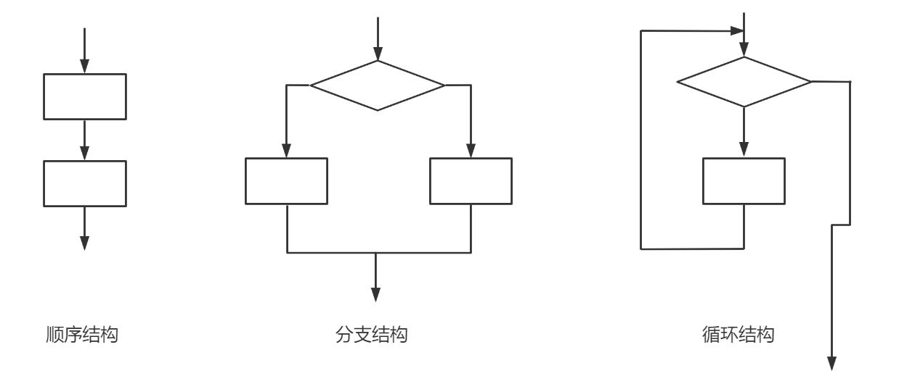
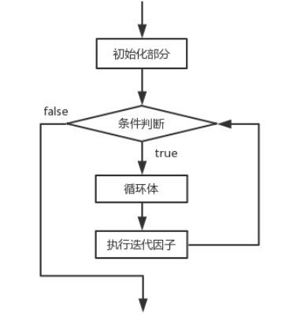
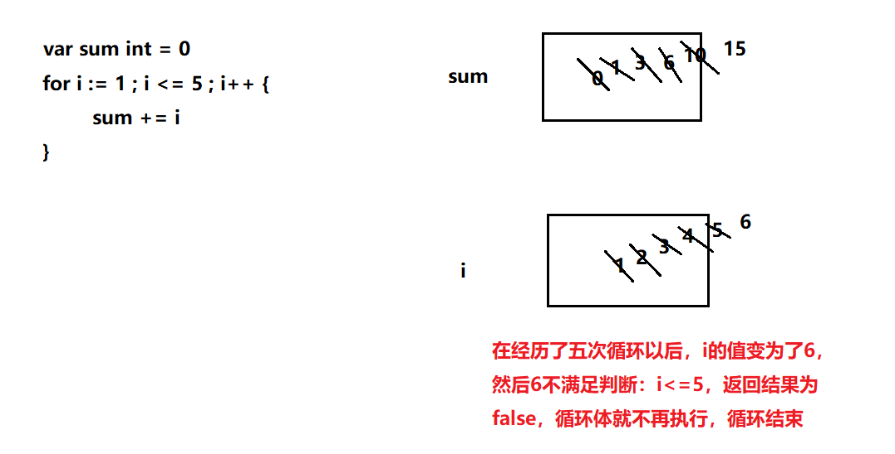
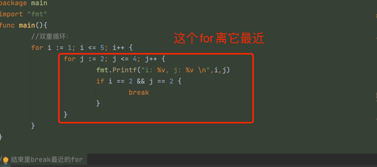

说白了就是上学时学的流程图


那在go中如何表现呢？

## if 分支
### 单个if
就像你和别人打赌：如果这次我读完这本书，就买一个冰淇淋
```go
package main
import "fmt"
func main(){
        //实现功能：如果口罩的库存小于30个，提示：库存不足：
        //var count int = 100
        //单分支：
        // if count < 30 {
        // 	fmt.Println("对不起，口罩存量不足")
        // }
        //if后面表达式，返回结果一定是true或者false，
        //如果返回结果为true的话，那么{}中的代码就会执行
        //如果返回结果为false的话，那么{}中的代码就不会执行
        //if后面一定要有空格，和条件表达式分隔开来
        //{}一定不能省略
        //条件表达式左右的()是建议省略的
        //在golang里，if后面可以并列的加入变量的定义：
        if count := 20;count < 30 {
                fmt.Println("对不起，口罩存量不足")
        }
}
```
### if else 双分支
就像你和别人打赌：如果这次我读完这本书，就买一个冰淇淋，读不完的话，我不买了
```go
package main
import "fmt"
func main(){
        //实现功能：如果口罩的库存小于30个，提示：库存不足,否则提示：库存充足
        //定义口罩的数量：
        var count int = 70
        if count < 30 { //这个条件表达式返回的是true的话，后面{}执行了
                fmt.Println("库存不足")
        } else {//count >= 30
                fmt.Println("库存充足")
        }
        //双分支一定会二选一走其中一个分支。
        
}
```
### 多分支
了解上面的话。应该就懂了，不懂自己百度
```go
package main
import "fmt"
func main(){
        //实现功能：根据给出的学生分数，判断学生的等级：
        // >=90  -----A
        // >=80  -----B
        // >=70  -----C
        // >=60  -----D
        // <60   -----E
        //方式1：利用if单分支实现：
        //定义一个学生的成绩：
        var score int = 18
        //对学生的成绩进行判定：
        // if score >= 90 {
        // 	fmt.Println("您的成绩为A级别")
        // }
        // if score >= 80 && score < 90 {
        // 	fmt.Println("您的成绩为B级别")
        // }
        // if score >= 70 && score < 80 {
        // 	fmt.Println("您的成绩为C级别")
        // }
        // if score >= 60 && score < 70 {
        // 	fmt.Println("您的成绩为D级别")
        // }
        // if score < 60 {
        // 	fmt.Println("您的成绩为E级别")
        // }
        //上面方式1利用多个单分支拼凑出多个选择，多个选择是并列的，依次从上而下顺序执行，即使走了第一个分支，那么其它分支也是需要判断
        
        //方式2：多分支：优点：如果已经走了一个分支了，那么下面的分支就不会再去判断执行了
        // if score >= 90 {
        // 	fmt.Println("您的成绩为A级别")
        // } else if score >= 80 {//else隐藏：score < 90
        // 	fmt.Println("您的成绩为B级别")
        // } else if score >= 70 {//score < 80
        // 	fmt.Println("您的成绩为C级别")
        // } else if score >= 60 {//score < 70
        // 	fmt.Println("您的成绩为D级别")
        // } else {//score < 60
        // 	fmt.Println("您的成绩为E级别")
        // } //建议你保证else的存在，只有有了else才会真正 起到多选一 的效果
        if score > 10 {
                fmt.Println("aaa")
        } else if score > 6{
                fmt.Println("bbb")
        }
}
```

## switch分支
没啥好说的，switch 条件 { case 满足这个条件 case ... case ... default 如果都不满足，则}
case可以是一个也可以多个，不妨自己动手试试
```go
package main
import "fmt"
func main(){
        //实现功能：根据给出的学生分数，判断学生的等级：
        // >=90  -----A
        // >=80  -----B
        // >=70  -----C
        // >=60  -----D
        // <60   -----E
        //给出一个学生分数：
        var score int = 187
        //根据分数判断等级：
        //switch后面是一个表达式，这个表达式的结果依次跟case进行比较，满足结果的话就执行冒号后面的代码。
        //default是用来“兜底”的一个分支，其它case分支都不走的情况下就会走default分支
        //default分支可以放在任意位置上，不一定非要放在最后。
//不用像java一样每个分支后面都加入break关键字
        switch score/10 {
                case 10 :
                        fmt.Println("您的等级为A级")
                case 9 :
                        fmt.Println("您的等级为A级")
                case 8 :
                        fmt.Println("您的等级为B级")
                case 7 :
                        fmt.Println("您的等级为C级")
                case 6 :
                        fmt.Println("您的等级为D级")
                case 5 :
                        fmt.Println("您的等级为E级")
                case 4 :
                        fmt.Println("您的等级为E级")
                case 3 :
                        fmt.Println("您的等级为E级")
                case 2 :
                        fmt.Println("您的等级为E级")
                case 1 :
                        fmt.Println("您的等级为E级")
                case 0 :
                        fmt.Println("您的等级为E级")
                default:
                        fmt.Println("您的成绩有误")
        }
        
}
```

## 循环
### for
```shell

for 初始表达式; 布尔表达式; 迭代因子 {
          循环体;
}
```

```go
package main
import "fmt"
func main(){
        //实现一个功能：求和： 1+2+3+4+5：
        //定义变量：
        var i1 int = 1
        var i2 int = 2
        var i3 int = 3
        var i4 int = 4
        var i5 int = 5
        //求和：
        //定义一个变量，用来接收这个和
        var sum int = 0
        sum += i1
        sum += i2
        sum += i3
        sum += i4
        sum += i5
        //输出结果：
        fmt.Println(sum)
}
```
```go
package main
import "fmt"
func main(){
        //实现一个功能：求和： 1+2+3+4+5：
        //求和：
        //利用for循环来解决问题：
        var sum int = 0
        for i := 1 ; i <= 5 ; i++ {
                sum += i
        }
        
        //输出结果：
        fmt.Println(sum)
        // for循环的语法格式：
        // for 初始表达式; 布尔表达式（条件判断）; 迭代因子 {
        // 	循环体;--》反复重复执行的内容
        // }
        // 注意：for的初始表达式 不能用var定义变量的形式，要用:=
        // 注意：for循环实际就是让程序员写代码的效率高了，但是底层该怎么执行还是怎么执行的，底层效率没有提高，只是程序员写代码简洁了而已
}
```

```go
package main
import "fmt"
func main(){
        i := 1 //变量的初始化
        for i<=5 {//条件表达式。判断条件
                fmt.Println("你好 Golang")//循环体
                i++//迭代
        }
}
```
死循环：
```go
package main
import "fmt"
func main(){
        //死循环：
        // for {
        // 	fmt.Println("你好 Golang")
        // }
        for ;; {
                fmt.Println("你好 Golang")
        }
//		在控制台中结束死循环：ctrl+c
}
```
### for range

```go
package main
import "fmt"
func main(){
        //定义一个字符串：
        var str string = "hello golang你好"
        //方式1：普通for循环：按照字节进行遍历输出的 （暂时先不使用中文）
        // for i := 0;i < len(str);i++ {//i:理解为字符串的下标
        // 	fmt.Printf("%c \n",str[i])
        // }
        //方式2：for range
        for i , value := range str {
                fmt.Printf("索引为：%d,具体的值为：%c \n",i,value)
        }
        //对str进行遍历，遍历的每个结果的索引值被i接收，每个结果的具体数值被value接收
        //遍历对字符进行遍历的
//		打个比方：我有一排东西，i 就是 第一个，value 就是第一个东西，如果想获取这个东西，我就要知道它在第几个位置。
//      索引说白了就是给你一个标签，你可以通过这个标签 快速知道这个东西
}
```

### break
```go
package main
import "fmt"
func main(){
        //功能：求1-100的和，当和第一次超过300的时候，停止程序
        var sum int = 0
        for i := 1 ; i <= 100 ; i++ {
                sum += i
                fmt.Println(sum)
                if sum >= 300 {
                        //停止正在执行的这个循环：说白了就是结束 离他最近的循环for
                        break 
                }
        }
        fmt.Println("-----ok")
}
```

```go
package main
import "fmt"
func main(){
        //双重循环：
        for i := 1; i <= 5; i++ {
                for j := 2; j <= 4; j++ {
                        fmt.Printf("i: %v, j: %v \n",i,j)
                        if i == 2 && j == 2 {
                                break
                        }
                }
        }
}

// 结束里break最近的for 
```


### continue
continue就没break那么牛了,
它是结束for中多次循环的本次
```go
package main
import "fmt"
func main(){
        //功能：输出1-100中被6整除的数：
        //方式1：
        // for i := 1; i <= 100; i++ {
        // 	if i % 6 == 0 {
        // 		fmt.Println(i)
        // 	}
        // }
        //方式2：
        for i := 1; i <= 100; i++ {
                if i % 6 != 0 {
                        continue //结束本次循环，继续下一次循环
                }
                fmt.Println(i)
        }
}
```
如果想理解的话，还是要自己耐心把每一步看一下，对照运行结果
```go
package main
import "fmt"
func main(){
        //双重循环：
        for i := 1; i <= 5; i++ {
                for j := 2; j <= 4; j++ {			
                        if i == 2 && j == 2 {
                                continue
                        }
                        fmt.Printf("i: %v, j: %v \n",i,j)
                }
        }
        fmt.Println("-----ok")
}
```

### return
```go
package main
import "fmt"
func main(){
        for i := 1; i <= 100; i++ {
                fmt.Println(i)
                if i == 14 {
                        return //结束当前的函数
                }
        }
        fmt.Println("hello golang")
}
//return 就是结束这个函数main（也可以是其他函数）
//(那你整个内容都是在这个main中写的，当执行return时，这个main就结束工作了)
```