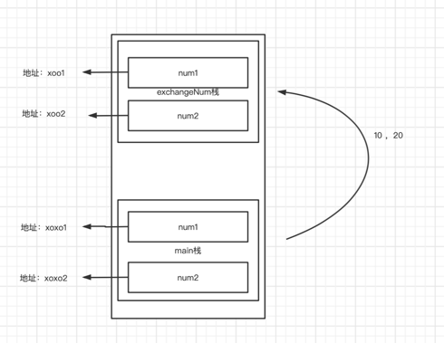

【1】为什么要使用函数：
提高代码的复用型，减少代码的冗余，代码的维护性也提高了

【2】函数的定义：
为完成某一功能的程序指令(语句)的集合,称为函数。
在函数的命名规定：驼峰命名（比如：addProduct）
【3】基本语法
func   函数名（形参列表)（返回值类型列表）{
执行语句..
return + 返回值列表
}
```go
package main
import "fmt"
// func   函数名（形参列表)（返回值类型列表）{
// 	执行语句..
// 	return + 返回值列表
// }
//自定义函数：功能：两个数相加：
func cal (num1 int,num2 int) (int) { //如果返回值类型就一个的话，那么()是可以省略不写的
        var sum int = 0
        sum += num1
        sum += num2
        return sum
}
func main(){
        //功能：10 + 20
        //调用函数：
        sum := cal(10,20)
        fmt.Println(sum)
        // var num1 int = 10
        // var num2 int = 20
        //求和：
        // var sum int = 0
        // sum += num1
        // sum += num2
        // fmt.Println(sum)
        //功能：30 + 50
        var num3 int = 30
        var num4 int = 50
        //调用函数：
        sum1 := cal(num3,num4)
        fmt.Println(sum1)
        //求和：
        // var sum1 int = 0
        // sum1 += num3
        // sum1 += num4
        // fmt.Println(sum1)
}
```
[main.go](main.go) 中这个问题是怎么回事

基本数据类型，默认是值传递，不会影响原本的值。

``结合现实场景就是：书店有一本，你没钱买，只能抄一份，你对副本任何操作都不会影响原本``

为啥第二个就发生了变化
``&和*是用于指针操作的两个重要符号``
- &符号：它用于获取变量的内存地址。相当我买了这本书，获取了这本书
- *符号：它用于解引用指针 ，相当可以对这本书进行各种操作，添加修改删除等操作
``如果我做的比方还让你不懂，，再通过百度查询深入了解``

```go
package main
import "fmt"
//定义一个函数：
func test(num int){
        fmt.Println(num)
}
func main(){
        //函数也是一种数据类型，可以赋值给一个变量	
        a := test//变量就是一个函数类型的变量
        fmt.Printf("a的类型是：%T,test函数的类型是：%T \n",a,test)//a的类型是：func(int),test函数的类型是：func(int)
        //通过该变量可以对函数调用
        a(10) //等价于  test(10)
}
```
```go
package main
import "fmt"
//定义一个函数：
func test(num int){
        fmt.Println(num)
}
//定义一个函数，把另一个函数作为形参：
func test02 (num1 int ,num2 float32, testFunc func(int)){
        fmt.Println("-----test02")
}
func main(){
        //函数也是一种数据类型，可以赋值给一个变量	
        a := test//变量就是一个函数类型的变量
        fmt.Printf("a的类型是：%T,test函数的类型是：%T \n",a,test)//a的类型是：func(int),test函数的类型是：func(int)
        //通过该变量可以对函数调用
        a(10) //等价于  test(10)
        //调用test02函数：
        test02(10,3.19,test)
        test02(10,3.19,a)
}
```

