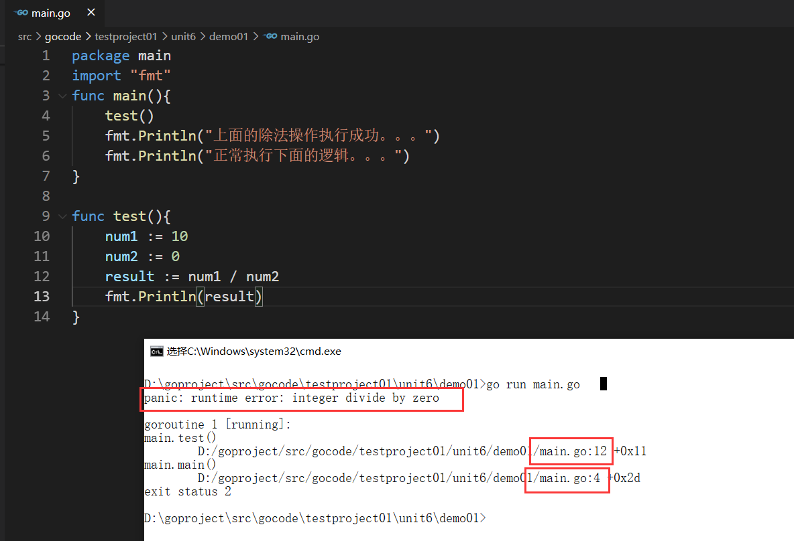
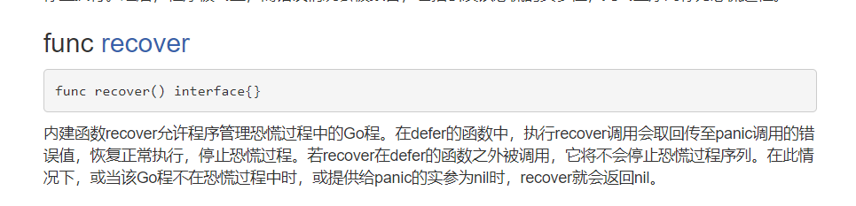
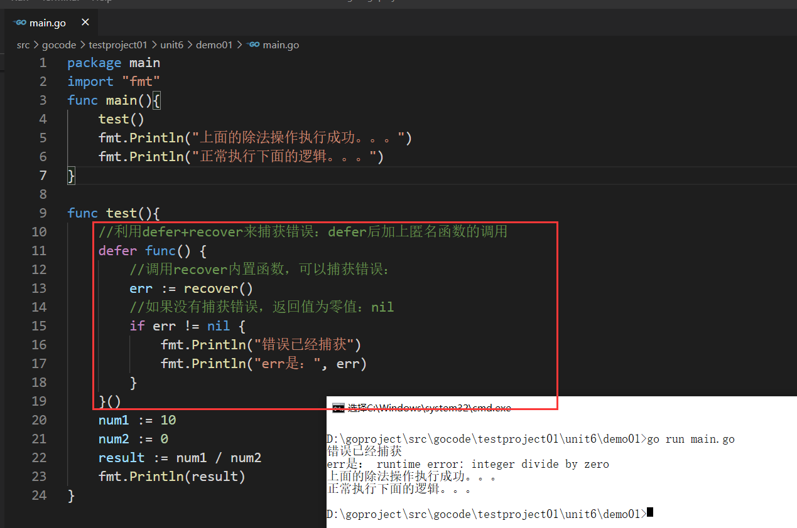
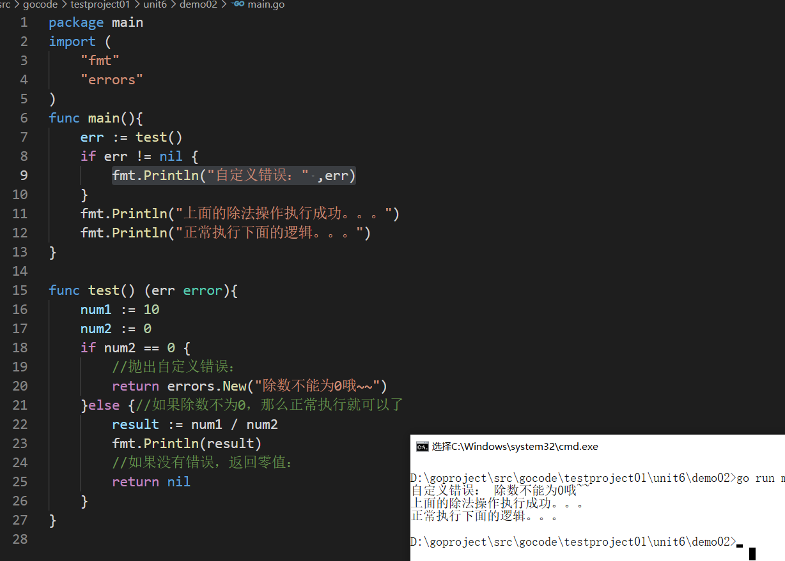
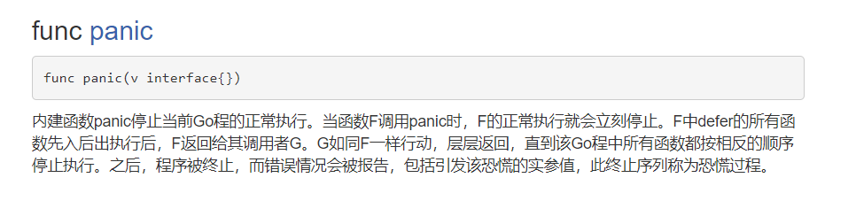
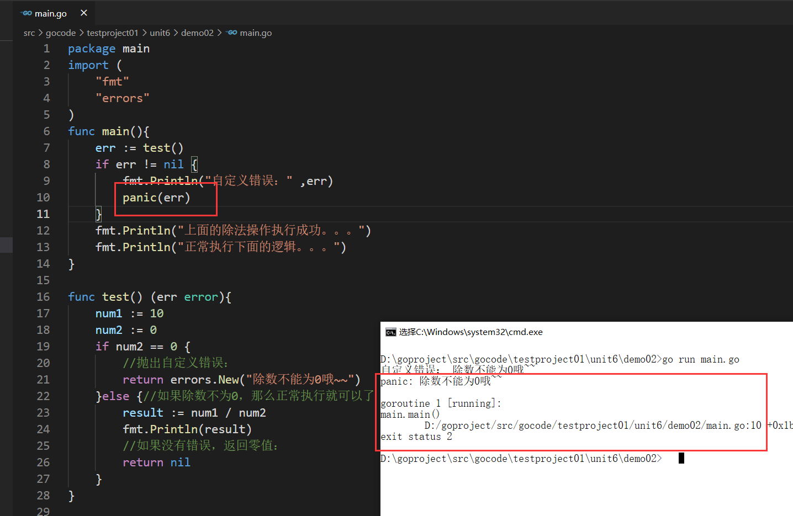

## defer+recover 机制处理错误

发现：程序中出现错误/恐慌以后，程序被中断，无法继续执行。

【2】错误处理/捕获机制：
go中追求代码优雅，引入机制：defer+recover机制处理错误

内置函数recover:

## 自定义异常
自定义错误：需要调用errors包下的New函数：函数返回error类型

有一种情况：程序出现错误以后，后续代码就没有必要执行，想让程序中断，退出程序：
借助：builtin包下内置函数：panic

