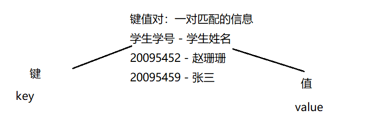
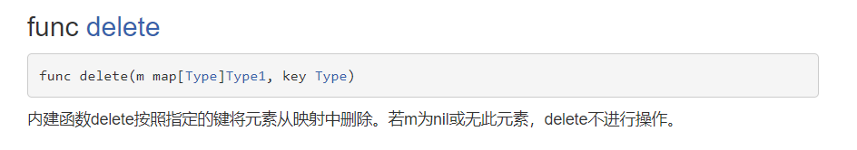

【1】映射（map）, Go语言中内置的一种类型，它将键值对相关联，我们可以通过键 key来获取对应的值 value。 类似其它语言的集合

【2】基本语法
var map变量名 map[keytype]valuetype

PS：key、value的类型：bool、数字、string、指针、channel 、还可以是只包含前面几个类型的接口、结构体、数组
PS：key通常为int 、string类型，value通常为数字（整数、浮点数）、string、map、结构体
PS：key：slice、map、function不可以

【3】代码：   
map的特点：
（1）map集合在使用前一定要make
（2）map的key-value是无序的
（3）key是不可以重复的，如果遇到重复，后一个value会替换前一个value
（4）value可以重复的
```go
package main
import "fmt"
func main(){
        //定义map变量：
        var a map[int]string
        //只声明map内存是没有分配空间
        //必须通过make函数进行初始化，才会分配空间：
        a = make(map[int]string,10) //map可以存放10个键值对
        //将键值对存入map中：
        a[20095452] = "张三"
        a[20095387] = "李四"
        a[20097291] = "王五"
        a[20095387] = "朱六"
        a[20096699] = "张三"
        //输出集合
        fmt.Println(a)
}
```
## 创建
```go
package main
import "fmt"
func main(){
        //方式1：
        //定义map变量：
        var a map[int]string
        //只声明map内存是没有分配空间
        //必须通过make函数进行初始化，才会分配空间：
        a = make(map[int]string,10) //map可以存放10个键值对
        //将键值对存入map中：
        a[20095452] = "张三"
        a[20095387] = "李四"
        //输出集合
        fmt.Println(a)
        //方式2：
        b := make(map[int]string)
        b[20095452] = "张三"
        b[20095387] = "李四"
        fmt.Println(b)
        //方式3：
        c := map[int]string{
                20095452 : "张三",
                20098765 : "李四",
        }
        c[20095387] = "王五"
        fmt.Println(c)
}
```
##操作
【1】增加和更新操作: \
map["key"]= value  ——》 如果key还没有，就是增加，如果key存在就是修改。  \
【2】删除操作： \
delete(map，"key") , delete是一个内置函数，如果key存在，就删除该key-value，如果k的y不存在，不操作，但是也不会报错

【3】清空操作： \
 1） 如果我们要删除map的所有key ,没有一个专门的方法一次删除，可以遍历一下key,逐个删除 \
 2） 或者map = make(...)，make一个新的，让原来的成为垃圾，被gc回收 \
【4】查找操作： \
value ,bool = map[key] \
value为返回的value，bool为是否返回 ，要么true 要么false  \
```go
package main
import "fmt"
func main(){
        //定义map
        b := make(map[int]string)
        //增加：
        b[20095452] = "张三"
        b[20095387] = "李四"
        //修改：
        b[20095452] = "王五"
        //删除：
        delete(b,20095387)
        delete(b,20089546)
        fmt.Println(b)
        //查找：
        value,flag := b[200]
        fmt.Println(value)
        fmt.Println(flag)
}
```
【5】获取长度：len函数

【6】遍历：for-range

```go
package main
import "fmt"
func main(){
        //定义map
        b := make(map[int]string)
        //增加：
        b[20095452] = "张三"
        b[20095387] = "李四"
        b[20098833] = "王五"
        //获取长度：
        fmt.Println(len(b))
        //遍历：
        for k,v := range b {
                fmt.Printf("key为：%v value为%v \t",k,v)
        }
        fmt.Println("---------------------------")
        //加深难度：
        a := make(map[string]map[int]string)
        //赋值：
        a["班级1"] = make(map[int]string,3)
        a["班级1"][20096677] = "露露"
        a["班级1"][20098833] = "丽丽"
        a["班级1"][20097722] = "菲菲"
        a["班级2"] = make(map[int]string,3)
        a["班级2"][20089911] = "小明"
        a["班级2"][20085533] = "小龙"
        a["班级2"][20087244] = "小飞"
        for k1,v1:= range a {
                fmt.Println(k1)
                for k2,v2:= range v1{
                        fmt.Printf("学生学号为：%v 学生姓名为%v \t",k2,v2)
                }
                fmt.Println()
        }
}
```