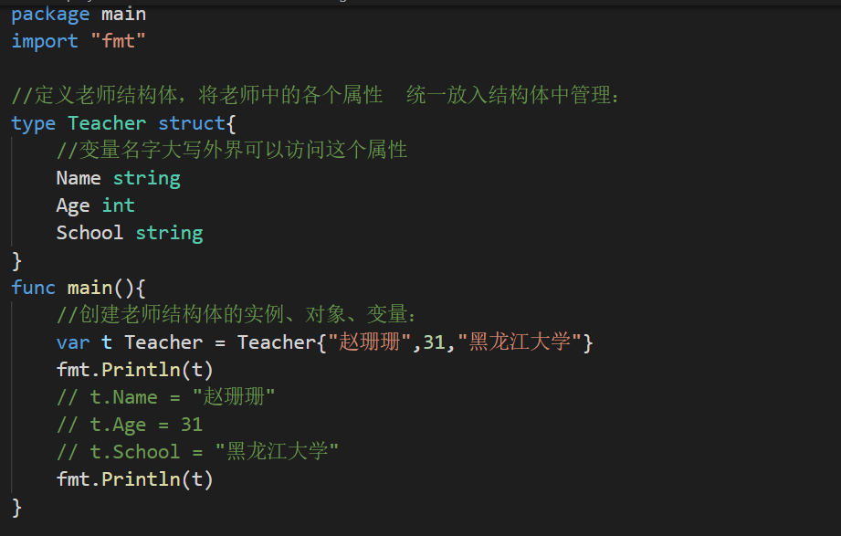
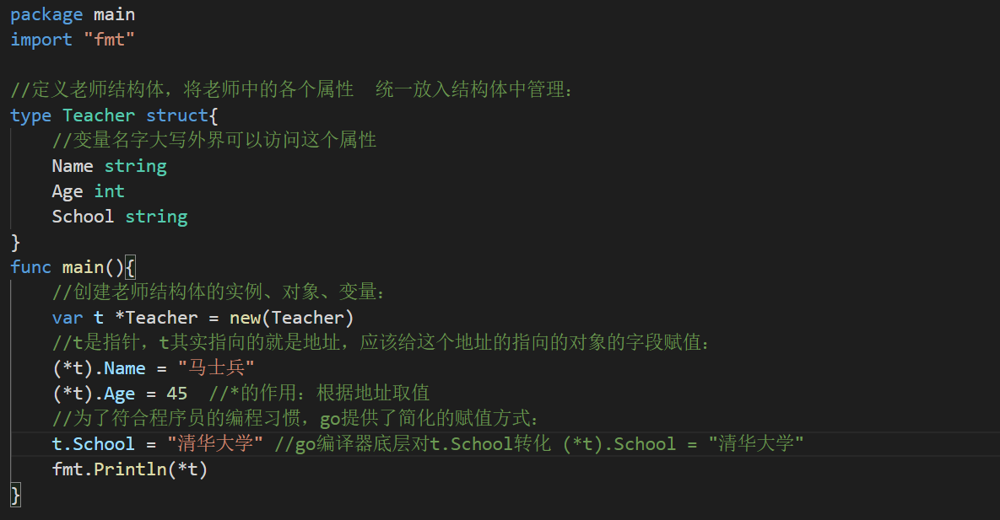
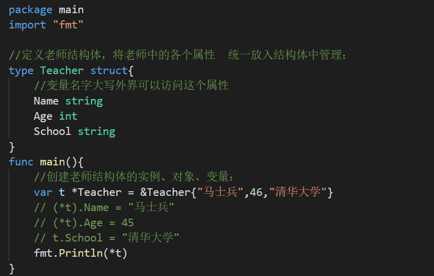

【1】Golang语言面向对象编程说明：
- （1）Golang也支持面向对象编程(OOP)，但是和传统的面向对象编程有区别，并不是纯粹的面向对象语言。所以我们说Golang支持面向对象编程特性是比较准确的。
- （2）Golang没有类(class)，Go语言的结构体(struct)和其它编程语言的类(class)有同等的地位，你可以理解Gelang是基于struct来实现OOP特性的。
- （3）Golang面向对象编程非常简洁，去掉了传统OOP语言的方法重载、构造函数和析构函数、隐藏的this指针等等
- （4）Golang仍然有面向对象编程的继承，封装和多态的特性，只是实现的方式和其它OOP语言不一样，比如继承:Golang没有extends 关键字，继承是通过匿名字段来实现。

【2】结构体的引入：

具体的对象：
一位老师：珊珊老师： 姓名：赵珊珊   年龄：31岁   性别 ：女 ......

可以使用变量来处理：
```go
package main
import "fmt"
func main(){
        //珊珊老师： 姓名：赵珊珊   年龄：31岁   性别 ：女
        var name string = "赵珊珊"
        var age int = 31
        var sex string = "女"
        //马士兵老师：
        var name2 string = "马士兵"
        var age2 int = 45
        var sex2 string = "男"
       
}
```
缺点：
（1）不利于数据的管理、维护
（2）老师的很多属性属于一个对象，用变量管理太分散了

## 结构体
```go
package main
import "fmt"
//定义老师结构体，将老师中的各个属性  统一放入结构体中管理：
type Teacher struct{
        //变量名字大写外界可以访问这个属性
        Name string
        Age int
        School string
}
func main(){
        //创建老师结构体的实例、对象、变量：
        var t1 Teacher // var a int
        fmt.Println(t1) //在未赋值时默认值：{ 0 }
        t1.Name = "MAX"
        t1.Age = 45
        t1.School = "家里蹲大学"
        fmt.Println(t1)
        fmt.Println(t1.Age + 10)
}
```
【2】方式2：

【3】方式3：返回的是结构体指针：


【4】方式4：返回的是结构体指针：



## 结构体之间转换
【1】结构体是用户单独定义的类型，和其它类型进行转换时需要有完全相同的字段(名字、个数和类型)
```go
package main
import "fmt"
type Student struct {
        Age int
}
type Person struct {
        Age int
}
func main(){
        var s Student = Student{10}
        var p Person = Person{10}
        s = Student(p)
        fmt.Println(s)
        fmt.Println(p)
}
```
【2】结构体进行type重新定义(相当于取别名)，Golang认为是新的数据类型，但是相互间可以强转
```go
package main
import "fmt"
type Student struct {
        Age int
}
type Stu Student
func main(){
        var s1 Student = Student{19}
        var s2 Stu = Stu{19}
        s1 = Student(s2)
        fmt.Println(s1)
        fmt.Println(s2)
}
```