## 封装
【1】什么是封装：
封装(encapsulation)就是把抽象出的字段和对字段的操作封装在一起，数据被保护在内部,程序的其它包只有通过被授权的操作方法，才能对字段进行操作。

【2】封装的好处：
1) 隐藏实现细节
2) 提可以对数据进行验证，保证安全合理

【3】Golang中如何实现封装：
1) 建议将结构体、字段(属性)的首字母小写(其它包不能使用，类似private，实际开发不小写也可能，因为封装没有那么严格)
2) 给结构体所在包提供一个工厂模式的函数，首字母大写（类似一个构造函数）
3) 提供一个首字母大写的Set方法(类似其它语言的public)，用于对属性判断并赋值
   func (var 结构体类型名)SetXxx(参数列表){
   //加入数据验证的业务逻辑
   var.Age =参数
   }
4) 提供一个首字母大写的Get方法(类似其它语言的public)，用于获取属性的值
   func (var结构体类型名) GetXxx() (返回值列表){
   return var.字段;
   }
5) 
   【4】代码实现：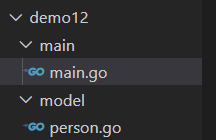
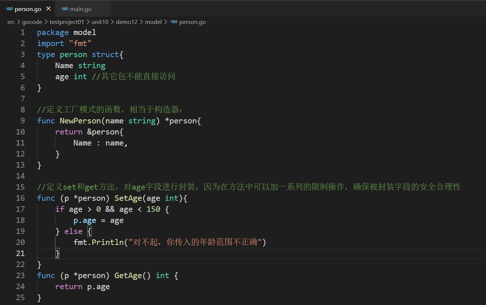
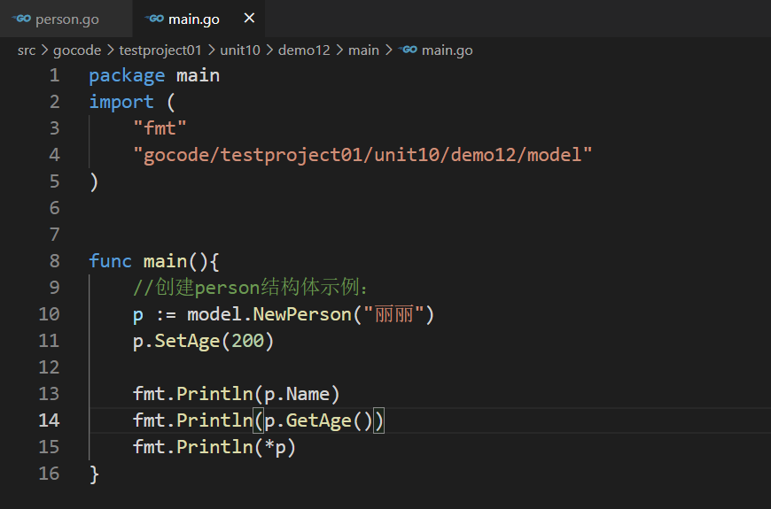

## 继承
【1】继承的引入：
当多个结构体存在相同的属性(字段)和方法时,可以从这些结构体中抽象出结构体,在该结构体中定义这些相同的属性和方法，其它的结构体不需要重新定义这些属性和方法，只需嵌套一个匿名结构体即可。也就是说:在Golang中，如果一个struct嵌套了另一个匿名结构体，那么这个结构体可以直接访问匿名结构体的字段和方法，从而实现了继承特性。
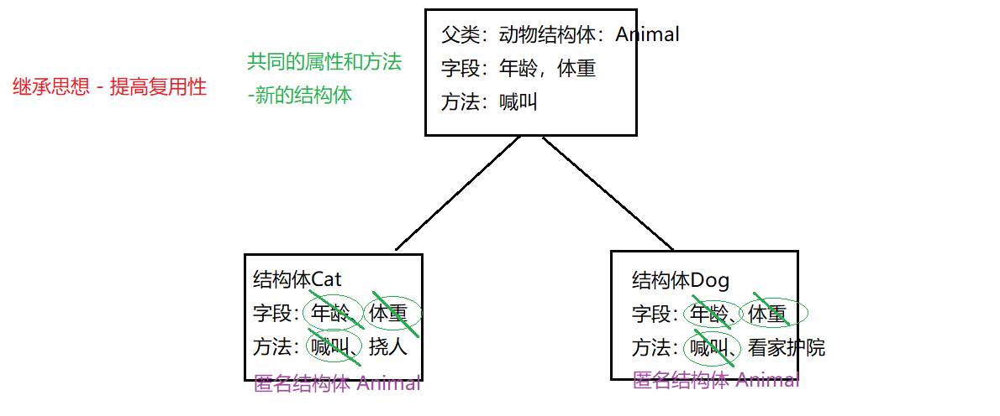
```go
package main
import (
        "fmt"
)
//定义动物结构体：
type Animal struct{
        Age int
        Weight float32
}
//给Animal绑定方法：喊叫：
func (an *Animal) Shout(){
        fmt.Println("我可以大声喊叫")
}
////给Animal绑定方法：自我展示：
func (an *Animal) ShowInfo(){
        fmt.Printf("动物的年龄是：%v,动物的体重是：%v",an.Age,an.Weight)
}
//定义结构体：Cat
type Cat struct{
        //为了复用性，体现继承思维，嵌入匿名结构体：——》将Animal中的字段和方法都达到复用
        Animal
}
//对Cat绑定特有的方法：
func (c *Cat) scratch(){
        fmt.Println("我是小猫，我可以挠人")
}
func main(){
        //创建Cat结构体示例：
        cat := &Cat{}
        cat.Animal.Age = 3
        cat.Animal.Weight = 10.6
        cat.Animal.Shout()
        cat.Animal.ShowInfo()
        cat.scratch()
}

```


【3】继承的优点：
提高代码的复用性、扩展性

【1】结构体可以使用嵌套匿名结构体所有的字段和方法，即:首字母大写或者小写的字段、方法，都可以使用。
```go
package main
import (
        "fmt"
)
//定义动物结构体：
type Animal struct{
        Age int
        weight float32
}
//给Animal绑定方法：喊叫：
func (an *Animal) Shout(){
        fmt.Println("我可以大声喊叫")
}
////给Animal绑定方法：自我展示：
func (an *Animal) showInfo(){
        fmt.Printf("动物的年龄是：%v,动物的体重是：%v",an.Age,an.weight)
}
//定义结构体：Cat
type Cat struct{
        //为了复用性，体现继承思维，嵌入匿名结构体：——》将Animal中的字段和方法都达到复用
        Animal
}
//对Cat绑定特有的方法：
func (c *Cat) scratch(){
        fmt.Println("我是小猫，我可以挠人")
}
func main(){
        //创建Cat结构体示例：
        cat := &Cat{}
        cat.Animal.Age = 3
        cat.Animal.weight = 10.6
        cat.Animal.Shout()
        cat.Animal.showInfo()
        cat.scratch()
}

```
【2】匿名结构体字段访问可以简化。
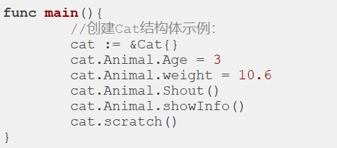

等价于：
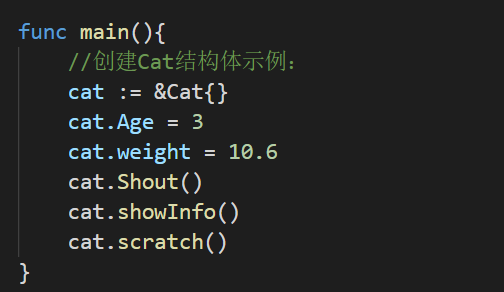

cat.Age --->cat对应的结构体中找是否有Age字段，如果有直接使用，如果没有就去找嵌入的结构体类型中的Age
【3】当结构体和匿名结构体有相同的字段或者方法时，编译器采用就近访问原则访问，如希望访问匿名结构体的字段和方法，可以通过匿名结构体名来区分。
```go
package main
import (
        "fmt"
)
//定义动物结构体：
type Animal struct{
        Age int
        weight float32
}
//给Animal绑定方法：喊叫：
func (an *Animal) Shout(){
        fmt.Println("我可以大声喊叫")
}
////给Animal绑定方法：自我展示：
func (an *Animal) showInfo(){
        fmt.Printf("动物的年龄是：%v,动物的体重是：%v",an.Age,an.weight)
}
//定义结构体：Cat
type Cat struct{
        //为了复用性，体现继承思维，嵌入匿名结构体：——》将Animal中的字段和方法都达到复用
        Animal
        Age int
}
func (c *Cat) showInfo(){
        fmt.Printf("~~~~~~~~动物的年龄是：%v,动物的体重是：%v",c.Age,c.weight)
}
//对Cat绑定特有的方法：
func (c *Cat) scratch(){
        fmt.Println("我是小猫，我可以挠人")
}
func main(){
        //创建Cat结构体示例：
        // cat := &Cat{}
        // cat.Age = 3
        // cat.weight = 10.6
        // cat.Shout()
        // cat.showInfo()
        // cat.scratch()
        cat := &Cat{}
        cat.weight = 9.4
        cat.Age = 10 //就近原则
        cat.Animal.Age = 20
        cat.showInfo()//就近原则
        cat.Animal.showInfo()
}


```

【4】Golang中支持多继承：如一个结构体嵌套了多个匿名结构体，那么该结构体可以直接访问嵌套的匿名结构体的字段和方法，从而实现了多重继承。为了保证代码的简洁性，建议大家尽量不使用多重继承，很多语言就将多重继承去除了，但是Go中保留了。
```go
package main
import (
        "fmt"
)
type A struct{
        a int
        b string
}
type B struct{
        c int
        d string
}
type C struct{
        A
        B
}
func main(){
        //构建C结构体实例：
        c := C{A{10,"aaa"},B{20,"ccc"}}
        fmt.Println(c)
}
```

【5】如嵌入的匿名结构体有相同的字段名或者方法名，则在访问时，需要通过匿名结构体类型名来区分。

```go
package main
import (
        "fmt"
)
type A struct{
        a int
        b string
}
type B struct{
        c int
        d string
        a int
}
type C struct{
        A
        B
}
func main(){
        //构建C结构体实例：
        c := C{A{10,"aaa"},B{20,"ccc",50}}
        fmt.Println(c.b)
        fmt.Println(c.d)
        fmt.Println(c.A.a)
        fmt.Println(c.B.a)
}
```
【6】结构体的匿名字段可以是基本数据类型。
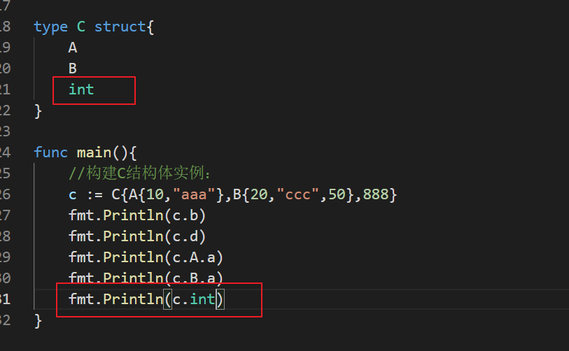
【7】嵌套匿名结构体后，也可以在创建结构体变量(实例)时，直接指定各个匿名结构体字段的值。

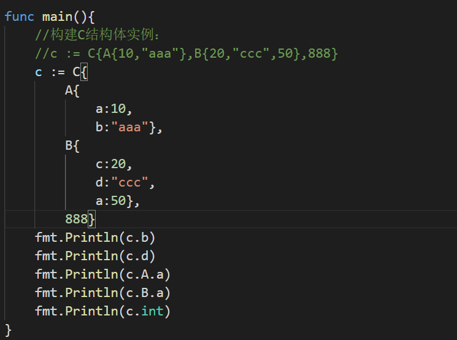

【8】嵌入匿名结构体的指针也是可以的。
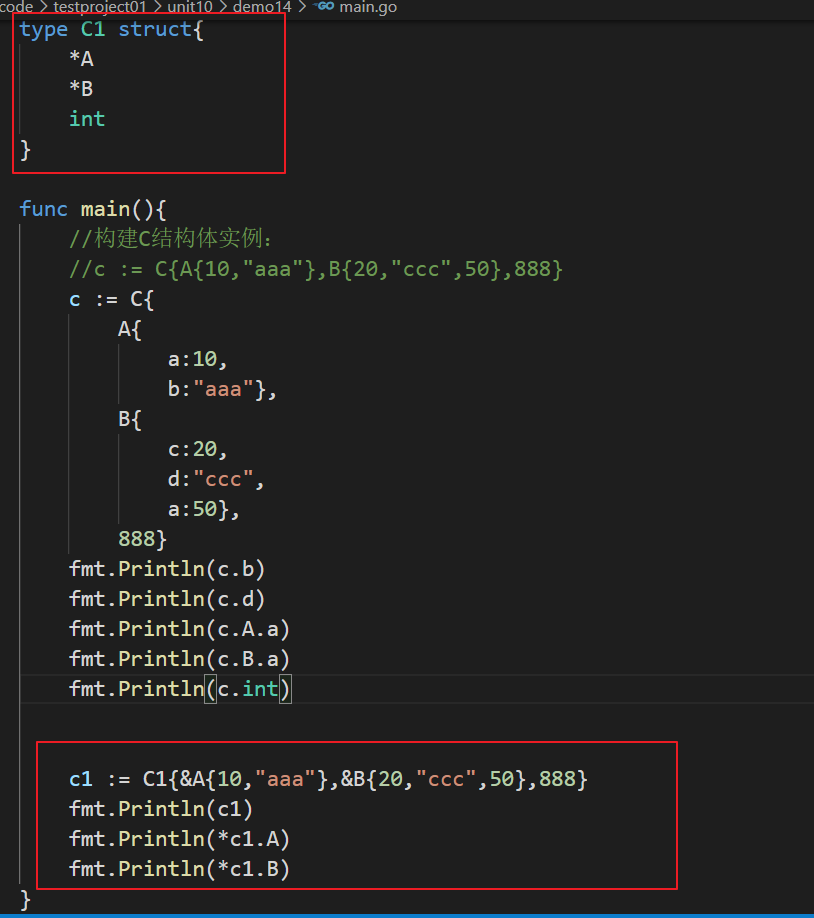

【9】结构体的字段可以是结构体类型的。（组合模式）
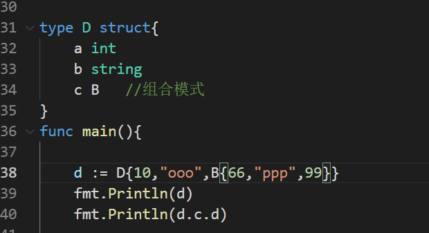

## 接口

```go
package main
import "fmt"
//接口的定义：定义规则、定义规范，定义某种能力：
type SayHello interface{
        //声明没有实现的方法：
        sayHello()
}
//接口的实现：定义一个结构体：
//中国人：
type Chinese struct{
}
//实现接口的方法---》具体的实现：
func (person Chinese) sayHello(){
        fmt.Println("你好")
}
//接口的实现：定义一个结构体：
//美国人：
type American struct{
}
//实现接口的方法---》具体的实现：
func (person American) sayHello(){
        fmt.Println("hi")
}
//定义一个函数：专门用来各国人打招呼的函数，接收具备SayHello接口的能力的变量：
func greet(s SayHello){
        s.sayHello()
}
func main(){
        //创建一个中国人：
        c := Chinese{}
        //创建一个美国人：
        a := American{}
        //美国人打招呼：
        greet(a)
        //中国人打招呼：
        greet(c)
}
```

【2】总结：

（1）接口中可以定义一组方法，但不需要实现，不需要方法体。并且接口中不能包含任何变量。到某个自定义类型要使用的时候（实现接口的时候）,再根据具体情况把这些方法具体实现出来。

（2）实现接口要实现所有的方法才是实现。

（3）Golang中的接口不需要显式的实现接口。Golang中没有implement关键字。

（Golang中实现接口是基于方法的，不是基于接口的）

例如：

A接口 a,b方法

B接口 a,b方法

C结构体 实现了  a,b方法 ，那么C实现了A接口，也可以说实现了B接口   （只要实现全部方法即可，和实际接口耦合性很低，比Java松散得多）

（4）接口目的是为了定义规范，具体由别人来实现即可。

【1】接口本身不能创建实例，但是可以指向一个实现了该接口的自定义类型的变量。
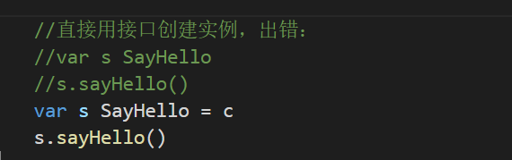
【2】只要是自定义数据类型，就可以实现接口，不仅仅是结构体类型。
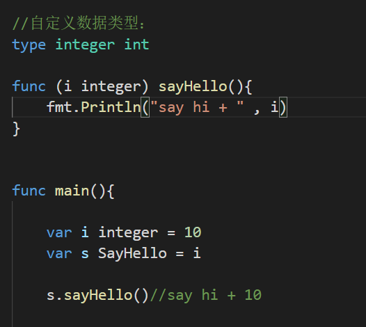
【3】一个自定义类型可以实现多个接口

```go
package main
import "fmt"
type AInterface interface{
        a()
}
type BInterface interface{
        b()
}
type Stu struct{
}
func (s Stu) a(){
        fmt.Println("aaaa")
}
func (s Stu) b(){
        fmt.Println("bbbb")
}
func main(){
        var s Stu
        var a AInterface = s
    var b BInterface = s
        a.a()
        b.b()
}
```
【4】一个接口(比如A接口)可以继承多个别的接口(比如B,C接口)，这时如果要实现A接口,也必须将B,C接口的方法也全部实现。

```go
package main
import "fmt"
type CInterface interface{
        c()
}
type BInterface interface{
        b()
}
type AInterface interface{
        BInterface
        CInterface
        a()
}
type Stu struct{
}
func (s Stu) a(){
        fmt.Println("a")
}
func (s Stu) b(){
        fmt.Println("b")
}
func (s Stu) c(){
        fmt.Println("c")
}
func main(){
        var s Stu
        var a AInterface = s
        a.a()
        a.b()
        a.c()
}
```

【5】interface类型默认是一个指针(引用类型)，如果没有对interface初始化就使用,那么会输出nil


【6】空接口没有任何方法,所以可以理解为所有类型都实现了空接口，也可以理解为我们可以把任何一个变量赋给空接口。
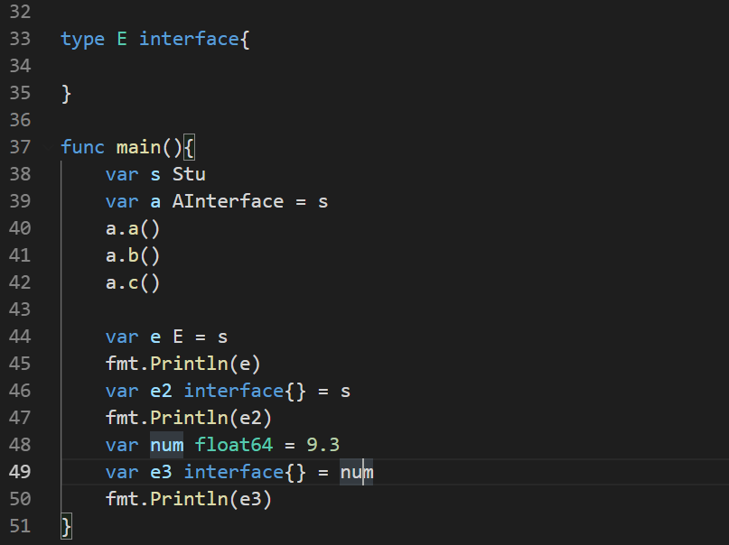

## 多态
【1】基本介绍
变量(实例)具有多种形态。面向对象的第三大特征，在Go语言，多态特征是通过接口实现的。可以按照统一的接口来调用不同的实现。这时接口变量就呈现不同的形态。

【2】案例：
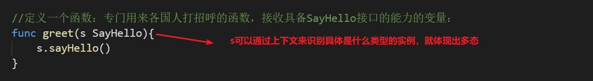

【3】接口体现多态特征
1) 多态参数： s叫多态参数
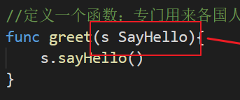
2) 多态数组 ：
   比如：定义SayHello数组，存放中国人结构体、美国人结构体
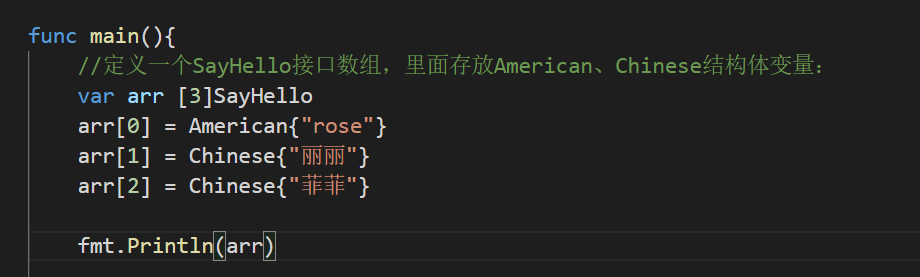

## 断言
【1】什么是断言？

Go语言里面有一个语法，可以直接判断是否是该类型的变量： value, ok := element.(T)，这里value就是变量的值，ok是一个bool类型，element是interface变量，T是断言的类型。
```go
package main
import "fmt"
//接口的定义：定义规则、定义规范，定义某种能力：
type SayHello interface{
        //声明没有实现的方法：
        sayHello()
}
//接口的实现：定义一个结构体：
//中国人：
type Chinese struct{
        name string
}
//实现接口的方法---》具体的实现：
func (person Chinese) sayHello(){
        fmt.Println("你好")
}
//中国人特有的方法
func (person Chinese) niuYangGe(){
        fmt.Println("东北文化-扭秧歌")
}
//接口的实现：定义一个结构体：
//美国人：
type American struct{
        name string
}
//实现接口的方法---》具体的实现：
func (person American) sayHello(){
        fmt.Println("hi")
}
//定义一个函数：专门用来各国人打招呼的函数，接收具备SayHello接口的能力的变量：
func greet(s SayHello){
        s.sayHello()
        //断言：
        var ch Chinese = s.(Chinese)//看s是否能转成Chinese类型并且赋给ch变量
        ch.niuYangGe()
}
func main(){
        
        //创建一个中国人：
        c := Chinese{}
        //创建一个美国人：
        //a := American{}
        //美国人打招呼：
        //greet(a)
        //中国人打招呼：
        greet(c)
}

```
解决第二个返回值问题：
```go
package main
import "fmt"
//接口的定义：定义规则、定义规范，定义某种能力：
type SayHello interface{
        //声明没有实现的方法：
        sayHello()
}
//接口的实现：定义一个结构体：
//中国人：
type Chinese struct{
        name string
}
//实现接口的方法---》具体的实现：
func (person Chinese) sayHello(){
        fmt.Println("你好")
}
//中国人特有的方法
func (person Chinese) niuYangGe(){
        fmt.Println("东北文化-扭秧歌")
}
//接口的实现：定义一个结构体：
//美国人：
type American struct{
        name string
}
//实现接口的方法---》具体的实现：
func (person American) sayHello(){
        fmt.Println("hi")
}
//定义一个函数：专门用来各国人打招呼的函数，接收具备SayHello接口的能力的变量：
func greet(s SayHello){
        s.sayHello()
        //断言：
        ch,flag := s.(Chinese)//看s是否能转成Chinese类型并且赋给ch变量,flag是判断是否转成功
        if flag == true{
                ch.niuYangGe()
        }else{
                fmt.Println("美国人不会扭秧歌")
        }
        fmt.Println("打招呼。。。")
}
func main(){
        
        //创建一个中国人：
        //c := Chinese{}
        //创建一个美国人：
        a := American{}
        //美国人打招呼：
        greet(a)
        //中国人打招呼：
        //greet(c)
}

```
更简略的语法：
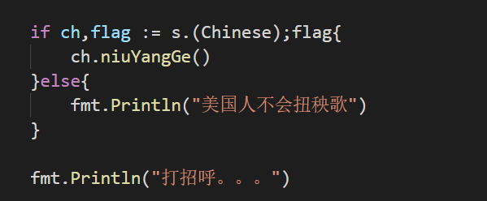
【3】Type Switch 的基本用法
Type Switch 是 Go 语言中一种特殊的 switch 语句，它比较的是类型而不是具体的值。它判断某个接口变量的类型，然后根据具体类型再做相应处理。
```go
package main
import "fmt"
//接口的定义：定义规则、定义规范，定义某种能力：
type SayHello interface{
        //声明没有实现的方法：
        sayHello()
}
//接口的实现：定义一个结构体：
//中国人：
type Chinese struct{
        name string
}
//实现接口的方法---》具体的实现：
func (person Chinese) sayHello(){
        fmt.Println("你好")
}
//中国人特有的方法
func (person Chinese) niuYangGe(){
        fmt.Println("东北文化-扭秧歌")
}
//接口的实现：定义一个结构体：
//美国人：
type American struct{
        name string
}
//实现接口的方法---》具体的实现：
func (person American) sayHello(){
        fmt.Println("hi")
}
func (person American) disco(){
        fmt.Println("野狼disco")
}
//定义一个函数：专门用来各国人打招呼的函数，接收具备SayHello接口的能力的变量：
func greet(s SayHello){
        s.sayHello()
        //断言：
        // ch,flag := s.(Chinese)//看s是否能转成Chinese类型并且赋给ch变量,flag是判断是否转成功
        // if flag == true{
        // 	ch.niuYangGe()
        // }else{
        // 	fmt.Println("美国人不会扭秧歌")
        // }
        
        // if ch,flag := s.(Chinese);flag{
        // 	ch.niuYangGe()
        // }else{
        // 	fmt.Println("美国人不会扭秧歌")
        // }
        switch s.(type){//type属于go中的一个关键字，固定写法
                case Chinese:
                        ch := s.(Chinese)
                        ch.niuYangGe()
                case American:
                        am := s.(American)
                        am.disco()
        }
        fmt.Println("打招呼。。。")
}
func main(){
        
        //创建一个中国人：
        c := Chinese{}
        //创建一个美国人：
        //a := American{}
        //美国人打招呼：
        //greet(a)
        //中国人打招呼：
        greet(c)
}

```