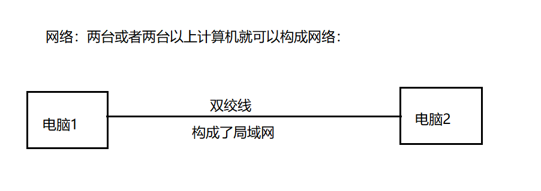
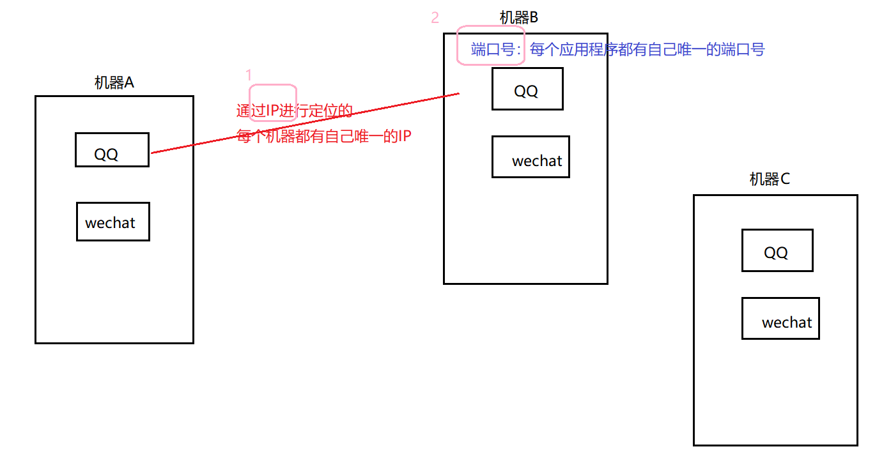
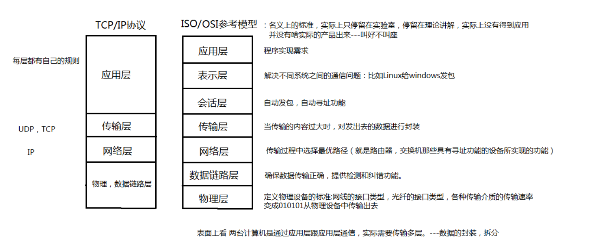
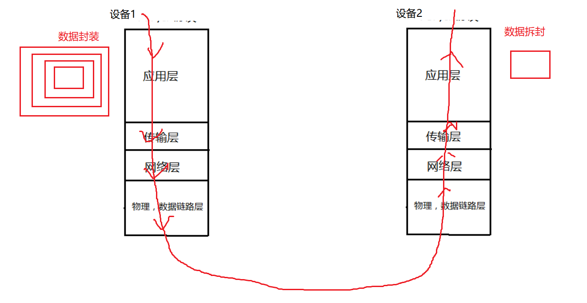
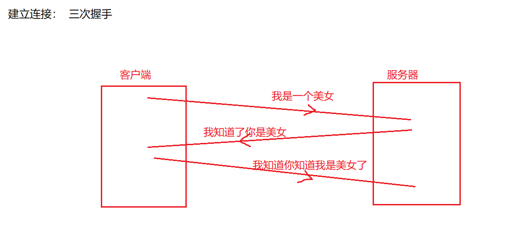
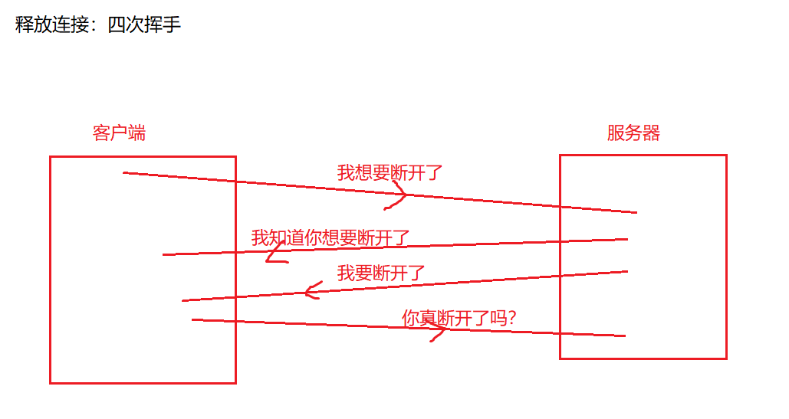
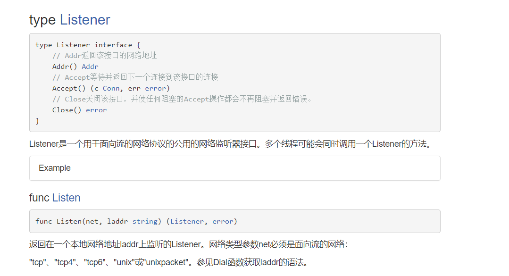
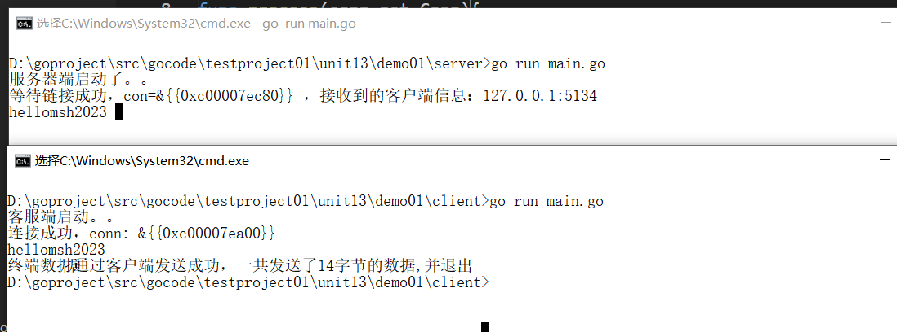

【1】网络编程：
把分布在不同地理区域的计算机与专门的外部设备用通信线路互连成一个规模大、功能强的网络系统，从而使众多的计算机可以方便地互相传递信息、共享硬件、软件、数据信息等资源。
设备之间在网络中进行数据的传输，发送/接收数据。

【2】通信两个重要的要素：IP+PORT 

【3】设备之间进行传输的时候，必须遵照一定的规则 ---》通信协议：


【4】TCP协议：可靠的
建立连接：  三次握手 

释放连接：四次挥手 

【5】UDP协议：不可靠的

## 基于TCP协议的网络通信
### 创建客户端
【1】调用Dial函数：（net包下）

```go
package main
import(
        "fmt"
        "net" //所需的网络编程全部都在net包下
)
func main(){
        //打印：
        fmt.Println("客服端启动。。")
        //调用Dial函数：参数需要指定tcp协议，需要指定服务器端的IP+PORT
        conn,err := net.Dial("tcp","127.0.0.1:8888")
        if err != nil {//连接失败
                fmt.Println("客户端连接失败：err:",err)
                return
        }
        fmt.Println("连接成功，conn:",conn)
}

```
### 创建服务器端
【1】进行监听：（Listen函数在net包下）

```go
package main
import(
        "fmt"
        "net" //所需的网络编程全部都在net包下
)
func main(){
        //打印：
        fmt.Println("服务器端启动了。。")
        //进行监听：需要指定服务器端TCP协议，服务器端的IP+PORT
        listen,err := net.Listen("tcp","127.0.0.1:8888")
        if err != nil{//监听失败
                fmt.Println("监听失败，err:",err)
                return
        }
        //监听成功以后：
        //循环等待客户端的链接：
        for{
                conn,err2 := listen.Accept()
                if err2 != nil {//客户端的等待失败
                        fmt.Println("客户端的等待失败,err2:",err2)
                }else{
                        //连接成功：
                        fmt.Printf("等待链接成功，con=%v ，接收到的客户端信息：%v \n",conn,conn.RemoteAddr().String())
                }
        }
}

```
运行时注意：需要先启动服务器端，然后启动客户端进行访问：

### 处理终端数据

1】客户端发送数据：
```go
package main
import(
        "fmt"
        "net" //所需的网络编程全部都在net包下
        "bufio"
        "os"
)
func main(){
        //打印：
        fmt.Println("客服端启动。。")
        //调用Dial函数：参数需要指定tcp协议，需要指定服务器端的IP+PORT
        conn,err := net.Dial("tcp","127.0.0.1:8888")
        if err != nil {//连接失败
                fmt.Println("客户端连接失败：err:",err)
                return
        }
        fmt.Println("连接成功，conn:",conn)
        //通过客户端发送单行数据，然后退出：
        reader := bufio.NewReader(os.Stdin)//os.Stdin代表终端标准输入
        //从终端读取一行用户输入的信息：
        str,err := reader.ReadString('\n')
        if err != nil {
                fmt.Println("终端输入失败，err:",err)
        }
        //将str数据发送给服务器：
        n,err := conn.Write([]byte(str))
        if err != nil{
                fmt.Println("连接失败，err:",err)
        }
        fmt.Printf("终端数据通过客户端发送成功，一共发送了%d字节的数据,并退出",n)
}
```
【2】服务器端接收数据：
```go
package main
import(
        "fmt"
        "net" //所需的网络编程全部都在net包下
)
func process(conn net.Conn){
        //连接用完一定要关闭：
        defer conn.Close()
        for{
                //创建一个切片，准备：将读取的数据放入切片：
                buf := make([]byte,1024)
                //从conn连接中读取数据：
                n,err := conn.Read(buf)
                if err != nil{
                        return
                }
                //将读取内容在服务器端输出：
                fmt.Println(string(buf[0:n]))
        }
}
func main(){
        //打印：
        fmt.Println("服务器端启动了。。")
        //进行监听：需要指定服务器端TCP协议，服务器端的IP+PORT
        listen,err := net.Listen("tcp","127.0.0.1:8888")
        if err != nil{//监听失败
                fmt.Println("监听失败，err:",err)
                return
        }
        //监听成功以后：
        //循环等待客户端的链接：
        for{
                conn,err2 := listen.Accept()
                if err2 != nil {//客户端的等待失败
                        fmt.Println("客户端的等待失败,err2:",err2)
                }else{
                        //连接成功：
                        fmt.Printf("等待链接成功，con=%v ，接收到的客户端信息：%v \n",conn,conn.RemoteAddr().String())
                }
                //准备一个协程，协程处理客户端服务请求：
                go process(conn)//不同的客户端的请求，连接conn不一样的
        }
}

```
【3】处理结果：

