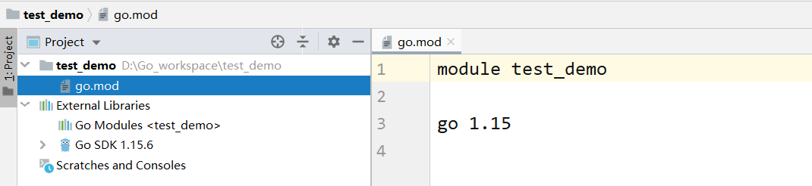

【类似Java中的Maven】

验证：

## 使用Goland创建GoModule项目
【1】new-project:

【2】配置：

【3】选择窗口打开位置：

【4】项目结构：

【5】安装第三方包和之前方式一样：
GoModule小试牛刀：web框架Gin安装
录入安装gin的命令：go get -u github.com/gin-gonic/gin

## Goland配置File Warchers
【1】go fmt 格式化（代码如果错乱，利用ctrl+s即可格式化）

【2】goimports自动导入包配置
结果：

如何配置：

第一次进入提示需要下载：
termi中录入命令：go get golang.org/x/tools/cmd/goimports 

配置成功以后：

PS：每一个项目需要重新配置一次
