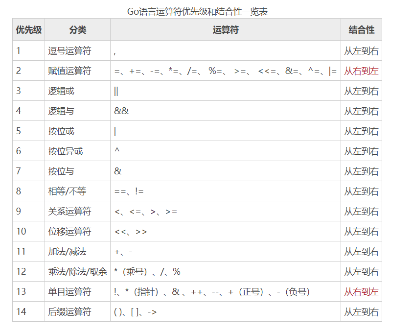

## 算术运算符
```go
package main
import "fmt"
func main(){
        //+加号：
        //1.正数 2.相加操作  3.字符串拼接
        var n1 int = +10
        fmt.Println(n1)
        var n2 int = 4 + 7
        fmt.Println(n2)
        var s1 string = "abc" + "def"
        fmt.Println(s1)
        // /除号：
        fmt.Println(10/3) //两个int类型数据运算，结果一定为整数类型
        fmt.Println(10.0/3)//浮点类型参与运算，结果为浮点类型
        // % 取模  等价公式： a%b=a-a/b*b
        fmt.Println(10%3) // 10%3= 10-10/3*3 = 1
        fmt.Println(-10%3)
        fmt.Println(10%-3)
        fmt.Println(-10%-3)
        //++自增操作：
        var a int = 10
        a++
        fmt.Println(a)
        a--
        fmt.Println(a)
        //++ 自增 加1操作，--自减，减1操作
        //go语言里，++，--操作非常简单，只能单独使用，不能参与到运算中去
        //go语言里，++，--只能在变量的后面，不能写在变量的前面 --a  ++a  错误写法
}
```
## 赋值运算符
```go
package main
import "fmt"
func main(){
        var num1 int = 10
        fmt.Println(num1)
        var num2 int = (10 + 20) % 3 + 3 - 7   //=右侧的值运算清楚后，再赋值给=的左侧
        fmt.Println(num2)
        var num3 int = 10
        num3 += 20 //等价num3 = num3 + 20;
        fmt.Println(num3)


//练习：交换两个数的值并输出结果：
        var a int = 8
        var b int = 4
        fmt.Printf("a = %v,b = %v",a,b)
        //交换：
        //引入一个中间变量：
        var t int
        t = a
        a = b
        b = t
        fmt.Printf("a = %v,b = %v",a,b)
```
## 关系运算符
```go
package main
import "fmt"
func main(){
        fmt.Println(5==9)//判断左右两侧的值是否相等，相等返回true，不相等返回的是false， ==不是=
        fmt.Println(5!=9)//判断不等于
        fmt.Println(5>9)
        fmt.Println(5<9)
        fmt.Println(5>=9)
        fmt.Println(5<=9)
}
```
## 逻辑运算符
```go
package main
import "fmt"
func main(){
        //与逻辑：&& :两个数值/表达式只要有一侧是false，结果一定为false
        //也叫短路与：只要第一个数值/表达式的结果是false，那么后面的表达式等就不用运算了，直接结果就是false  -->提高运算效率
        fmt.Println(true&&true)
        fmt.Println(true&&false)
        fmt.Println(false&&true)
        fmt.Println(false&&false)
        //或逻辑：||:两个数值/表达式只要有一侧是true，结果一定为true
        //也叫短路或：只要第一个数值/表达式的结果是true，那么后面的表达式等就不用运算了，直接结果就是true -->提高运算效率
        fmt.Println(true||true)
        fmt.Println(true||false)
        fmt.Println(false||true)
        fmt.Println(false||false)
        //非逻辑：取相反的结果：
        fmt.Println(!true)
        fmt.Println(!false)
}
```
## 指针
```go
package main
import "fmt"
// & ：返回变量的存储地址 
// *：取指针变量对应的数值
func main(){
        //定义一个变量：
        var age int = 18
        fmt.Println("age对应的存储空间的地址为：",&age)//age对应的存储空间的地址为： 0xc0000100b0
        var ptr *int = &age
        fmt.Println(ptr)
        fmt.Println("ptr这个指针指向的具体数值为：",*ptr)
}
```


## 键盘输入
```go
package main
import "fmt"
func main(){
        //实现功能：键盘录入学生的年龄，姓名，成绩，是否是VIP
        //方式1：Scanln
        var age int
        // fmt.Println("请录入学生的年龄：")
        //传入age的地址的目的：在Scanln函数中，对地址中的值进行改变的时候，实际外面的age被影响了
        //fmt.Scanln(&age)//录入数据的时候，类型一定要匹配，因为底层会自动判定类型的
        var name string
        // fmt.Println("请录入学生的姓名：")
        // fmt.Scanln(&name)
        var score float32
        // fmt.Println("请录入学生的成绩：")
        // fmt.Scanln(&score)
        var isVIP bool
        // fmt.Println("请录入学生是否为VIP：")
        // fmt.Scanln(&isVIP)
        //将上述数据在控制台打印输出：
        //fmt.Printf("学生的年龄为：%v,姓名为：%v,成绩为：%v,是否为VIP:%v",age,name,score,isVIP)
        //方式2：Scanf
        fmt.Println("请录入学生的年龄，姓名，成绩，是否是VIP，使用空格进行分隔")
        fmt.Scanf("%d %s %f %t",&age,&name,&score,&isVIP)
        //将上述数据在控制台打印输出：
        fmt.Printf("学生的年龄为：%v,姓名为：%v,成绩为：%v,是否为VIP:%v",age,name,score,isVIP)
}
```