# 基础数据类型，自己了解一下，不懂的就百度
【1】进制的介绍：
十进制整数，如：99, -500, 0
八进制整数，要求以 0 开头，如：015
十六进制数，要求 0x 或 0X 开头，如：0x15
二进制：要求0b或者0B开头，如：0b11


几进制：就是逢几进1的问题：

平时实际生活中用的最多的是：十进制
计算机用二进制最多
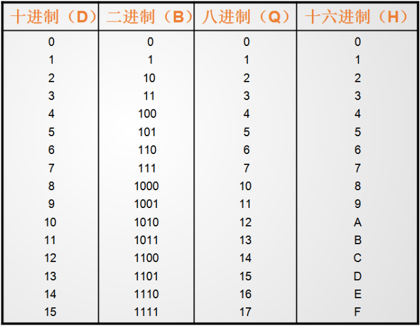


【2】二进制转换为十进制：
二进制： 1101

    1*2^3  +   1*2^2   +  0*2^1  +     1*2^0
=    8         +      4       +     0       +      1
=  13


【3】十进制转换为二进制：
十进制  13
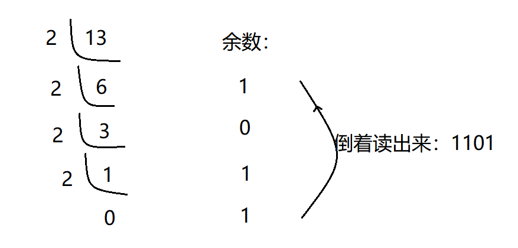

【4】八进制转换十进制：
八进制： 16

1*8^1 +   6*8^0
=   8     +  6
=14


【5】十进制转换为八进制：
十进制14：
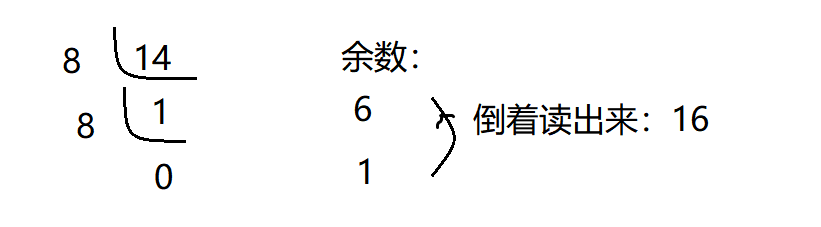

【6】八进制转换为十六进制：

把十进制当做一个中转站：

八进制---》十进制---》十六进制

## 整型
【1】整数类型介绍：
简单的说，就是用于存放整数值的，比如10,-45,6712等等。

【2】有符号整数类型：

PS:127怎么算出来的？
01111111 -->二进制 ---》转为十进制：
1*2^6   +   1*2^5  +  1*2^4  +   1*2^3  +   1*2^2  +   1*2^1  +    1*2^0
= 64      +   32         +    16          +   8        +      4       +    2     +   1
= 127


PS：-128怎么算出来的？
10000000 --->二进制 --->一看就是个负数

        10000000 --》负数的二进制
减1：01111111
取反：10000000     ---》得到一个正数    2^7 = 128
加负号：-128


代码测试超出范围：
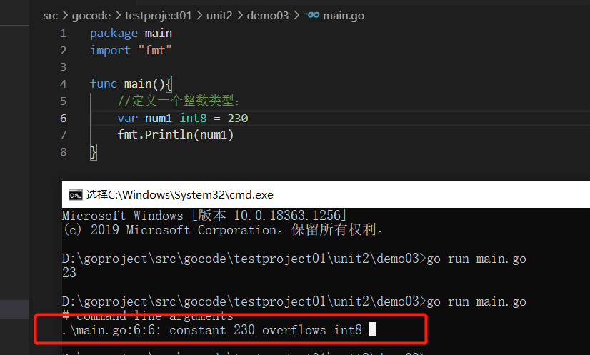


【3】无符号整数类型：
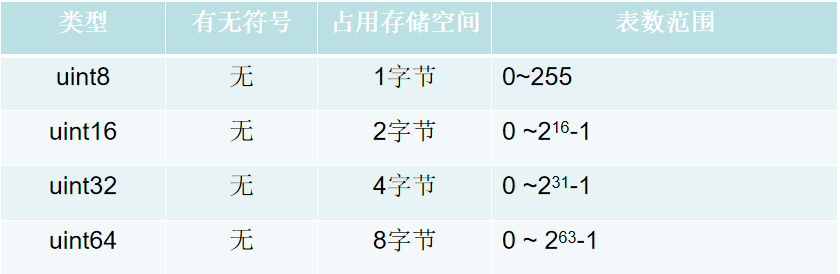
表数范围的边界计算：
11111111= 2^7+127 = 128 + 127 = 255
00000000 = 0
超出边界报错：

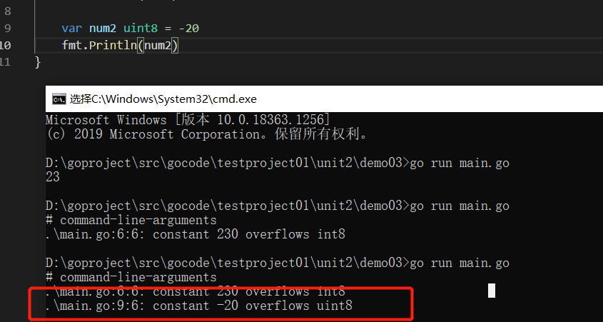

【4】其他整数类型：

PS：Golang的整数类型，默认声明为int类型
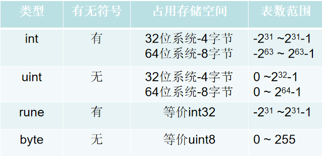
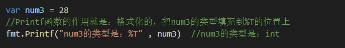


PS :变量占用的字节数：
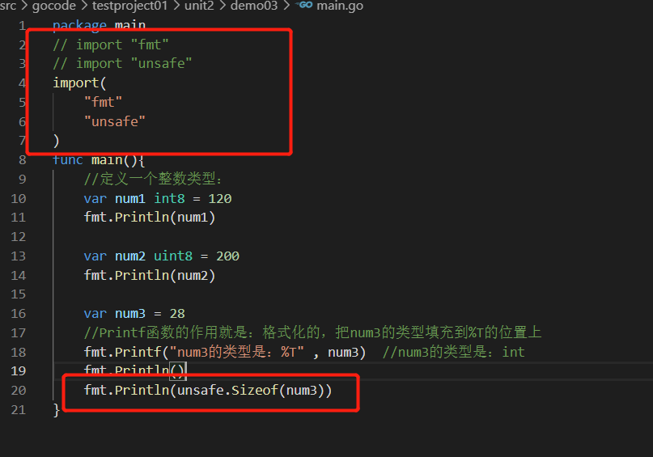


【5】这么多整数类型，使用的时候该如何选择呢？
Golang程序中整型变量在使用时,遵守保小不保大的原则,
即:在保证程序正确运行下,尽量使用占用空间小的数据类型
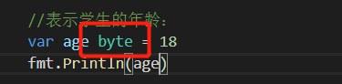


## 浮点型
```go
package main
import "fmt"
func main(){
        //定义浮点类型的数据：
        var num1 float32 = 3.14
        fmt.Println(num1)
        //可以表示正浮点数，也可以表示负的浮点数
        var num2 float32 = -3.14
        fmt.Println(num2)
        //浮点数可以用十进制表示形式，也可以用科学计数法表示形式  E 大写小写都可以的
        var num3 float32 = 314E-2 
        fmt.Println(num3)
        var num4 float32 = 314E+2
        fmt.Println(num4)
        var num5 float32 = 314e+2
        fmt.Println(num5)
        var num6 float64 = 314e+2
        fmt.Println(num6)
        //浮点数可能会有精度的损失，所以通常情况下，建议你使用：float64 
        var num7 float32 = 256.000000916
        fmt.Println(num7)
        var num8 float64 = 256.000000916
        fmt.Println(num8)
        //golang中默认的浮点类型为：float64 
        var num9 = 3.17
        fmt.Printf("num9对应的默认的类型为：%T",num9)
}
```

## 字符
【1】Golang中没有专门的字符类型，如果要存储单个字符(字母)，一般使用byte来保存。
【2】Golang中字符使用UTF-8编码
【3】ASCII码表：
左面是不可见字符 右面是可见字符


```go
package main
import "fmt"
func main(){
        //定义字符类型的数据：
        var c1 byte = 'a'
        fmt.Println(c1)//97
        var c2 byte = '6'
        fmt.Println(c2)//54
        var c3 byte = '('
        fmt.Println(c3 + 20)//40
        //字符类型，本质上就是一个整数，也可以直接参与运算，输出字符的时候，会将对应的码值做一个输出
        //字母，数字，标点等字符，底层是按照ASCII进行存储。
        var c4 int = '中'
        fmt.Println(c4)
        //汉字字符，底层对应的是Unicode码值
        //对应的码值为20013，byte类型溢出，能存储的范围：可以用int
        //总结：Golang的字符对应的使用的是UTF-8编码（Unicode是对应的字符集，UTF-8是Unicode的其中的一种编码方案）
        var c5 byte = 'A'
        //想显示对应的字符，必须采用格式化输出
        fmt.Printf("c5对应的具体的字符为：%c",c5)
}
```
## 布尔
【1】布尔类型也叫bool类型，bool类型数据只允许取值true和false
【2】布尔类型占1个字节。
【3】布尔类型适于逻辑运算，一般用于程序流程控制
【4】代码：
```go
package main
import "fmt"
func main(){
        //测试布尔类型的数值：
        var flag01 bool = true
        fmt.Println(flag01)
        var flag02 bool = false
        fmt.Println(flag02)
        var flag03 bool = 5 < 9
        fmt.Println(flag03)
}

```

## 字符串
其实就是一句话，例如Excel中的文本
```go
package main
import "fmt"
func main(){
        //1.定义一个字符串：
        var s1 string = "你好全面拥抱Golang"
        fmt.Println(s1)
        //2.字符串是不可变的：指的是字符串一旦定义好，其中的字符的值不能改变
        var s2 string = "abc"
        //s2 = "def"
        //s2[0] = 't'
        fmt.Println(s2)
        //3.字符串的表示形式：
        //（1）如果字符串中没有特殊字符，字符串的表示形式用双引号
        //var s3 string = "asdfasdfasdf"
        //（2）如果字符串中有特殊字符，字符串的表示形式用反引号 ``
        var s4 string = `
        package main
        import "fmt"
        
        func main(){
                //测试布尔类型的数值：
                var flag01 bool = true
                fmt.Println(flag01)
        
                var flag02 bool = false
                fmt.Println(flag02)
        
                var flag03 bool = 5 < 9
                fmt.Println(flag03)
        }
        `
        fmt.Println(s4)
        //4.字符串的拼接效果：
        var s5 string = "abc" + "def"
        s5 += "hijk"
        fmt.Println(s5)
        //当一个字符串过长的时候：注意：+保留在上一行的最后
        var s6 string = "abc" + "def" + "abc" + "def" + "abc" + "def" + "abc" +
         "def"+ "abc" + "def" + "abc" + "def"+ "abc" + "def" + "abc" + "def"+
          "abc" + "def" + "abc" + "def"+ "abc" + "def" + "abc" + "def"+ "abc" +
           "def" + "abc" + "def"+ "abc" + "def" + "abc" + "def"+ "abc" + "def" + 
           "abc" + "def"+ "abc" + "def"
        fmt.Println(s6)
}

```

## 基础数据类型之间的转换
```go
package main
import "fmt"
func main(){
        //进行类型转换：
        var n1 int = 100
        //var n2 float32 = n1  在这里自动转换不好使，比如显式转换
        fmt.Println(n1)
        //fmt.Println(n2)
        var n2 float32 = float32(n1)
        fmt.Println(n2)
        //注意：n1的类型其实还是int类型，只是将n1的值100转为了float32而已，n1还是int的类型
        fmt.Printf("%T",n1)  //int
        fmt.Println()
        //将int64转为int8的时候，编译不会出错的，但是会数据的溢出
        var n3 int64 = 888888
        var n4 int8 = int8(n3)
        fmt.Println(n4)//56
        var n5 int32 = 12
        var n6 int64 = int64(n5) + 30  //一定要匹配=左右的数据类型
        fmt.Println(n5)
        fmt.Println(n6)
        var n7 int64 = 12
        var n8 int8 = int8(n7) + 127  //编译通过，但是结果可能会溢出
        //var n9 int8 = int8(n7) + 128 //编译不会通过
        fmt.Println(n8)
        //fmt.Println(n9)
}
```

【1】基本数据类型和string的转换介绍
在程序开发中，我们经常需要将基本数据类型转成string类型。或者将string类型转成基本数据类型。
【2】基本类型转string类型
方式1:fmt.Sprintf("%参数",表达式)    ---》 重点练习这个，推荐方式
方式2:使用strconv包的函数   
```go
package main
import "fmt"
func main(){
        var n1 int = 19
        var n2 float32 = 4.78
        var n3 bool = false
        var n4 byte = 'a'
        var s1 string = fmt.Sprintf("%d",n1)
        fmt.Printf("s1对应的类型是：%T ，s1 = %q \n",s1, s1)
        var s2 string = fmt.Sprintf("%f",n2)
        fmt.Printf("s2对应的类型是：%T ，s2 = %q \n",s2, s2)
        var s3 string = fmt.Sprintf("%t",n3)
        fmt.Printf("s3对应的类型是：%T ，s3 = %q \n",s3, s3)
        var s4 string = fmt.Sprintf("%c",n4)
        fmt.Printf("s4对应的类型是：%T ，s4 = %q \n",s4, s4)
}
```
```go
package main
import(
        "fmt"
        "strconv"
)
func main(){
        var n1 int = 18
        var s1 string = strconv.FormatInt(int64(n1),10)  //参数：第一个参数必须转为int64类型 ，第二个参数指定字面值的进制形式为十进制
        fmt.Printf("s1对应的类型是：%T ，s1 = %q \n",s1, s1)
        var n2 float64 = 4.29
        var s2 string = strconv.FormatFloat(n2,'f',9,64)
        //第二个参数：'f'（-ddd.dddd）  第三个参数：9 保留小数点后面9位  第四个参数：表示这个小数是float64类型
        fmt.Printf("s2对应的类型是：%T ，s2 = %q \n",s2, s2)
        var n3 bool = true
        var s3 string = strconv.FormatBool(n3)
        fmt.Printf("s3对应的类型是：%T ，s3 = %q \n",s3, s3)
}
```
【1】string类型转基本类型
方式:使用strconv包的函数   
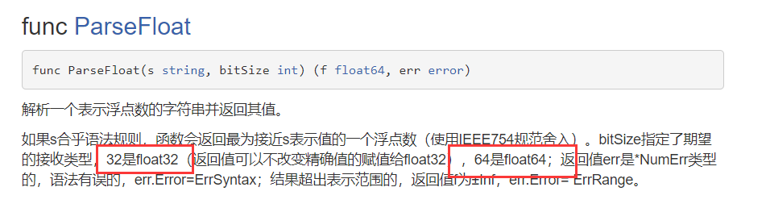
```go
package main
import(
        "fmt"
        "strconv"
)
func main(){
        //string-->bool
        var s1 string = "true"
        var b bool
        //ParseBool这个函数的返回值有两个：(value bool, err error)
        //value就是我们得到的布尔类型的数据，err出现的错误
        //我们只关注得到的布尔类型的数据，err可以用_直接忽略
        b , _ = strconv.ParseBool(s1)
        fmt.Printf("b的类型是：%T,b=%v \n",b,b)
        //string---》int64
        var s2 string = "19"
        var num1 int64
        num1,_ = strconv.ParseInt(s2,10,64)
        fmt.Printf("num1的类型是：%T,num1=%v \n",num1,num1)
        //string-->float32/float64
        var s3 string = "3.14"
        var f1 float64
        f1,_ = strconv.ParseFloat(s3,64)
        fmt.Printf("f1的类型是：%T,f1=%v \n",f1,f1)
        //注意：string向基本数据类型转换的时候，一定要确保string类型能够转成有效的数据类型，否则最后得到的结果就是按照对应类型的默认值输出
        var s4 string = "golang"
        var b1 bool
        b1 , _ = strconv.ParseBool(s4)
        fmt.Printf("b1的类型是：%T,b1=%v \n",b1,b1)
        var s5 string = "golang"
        var num2 int64
        num2,_ = strconv.ParseInt(s5,10,64)
        fmt.Printf("num2的类型是：%T,num2=%v \n",num2,num2)
}

```