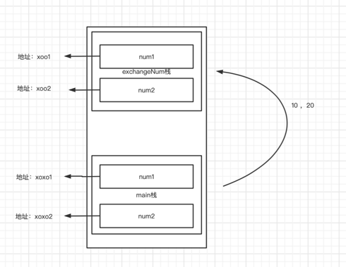
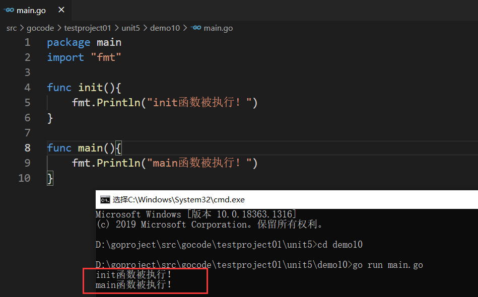
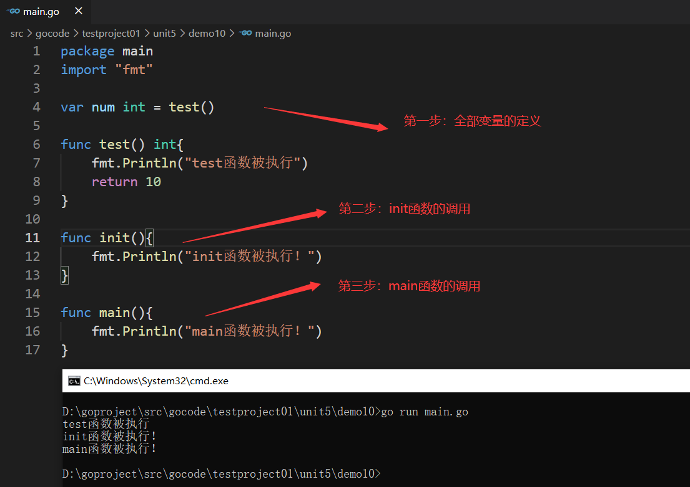
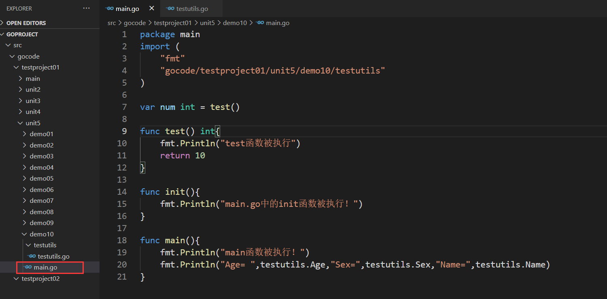
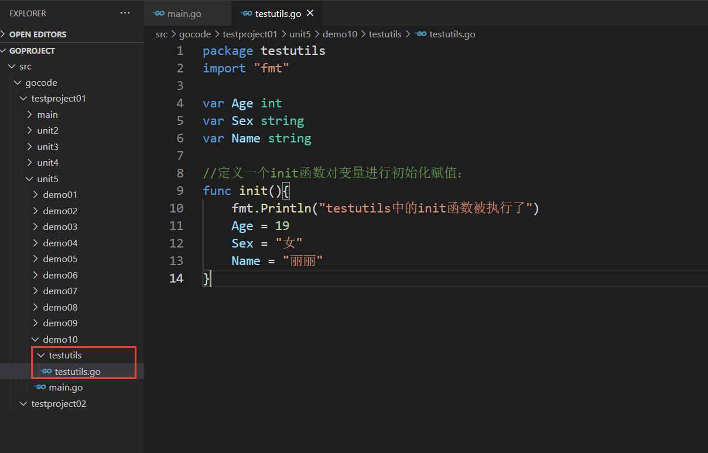
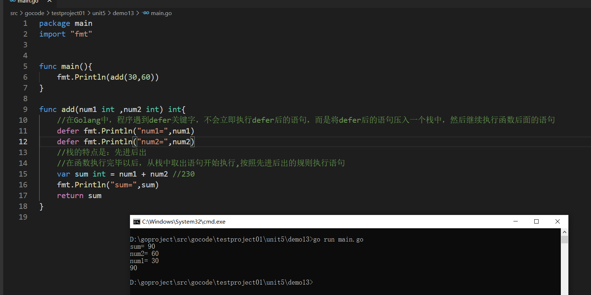
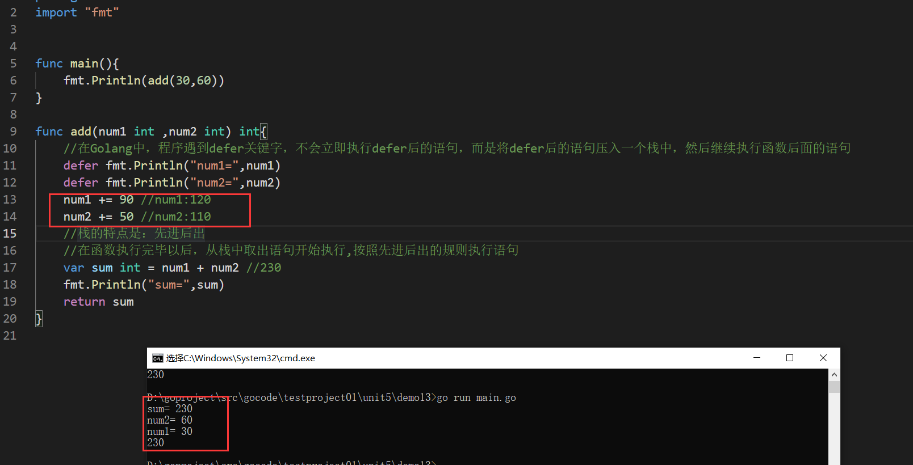

【1】为什么要使用函数：
提高代码的复用型，减少代码的冗余，代码的维护性也提高了

【2】函数的定义：
为完成某一功能的程序指令(语句)的集合,称为函数。
在函数的命名规定：驼峰命名（比如：addProduct）
【3】基本语法
func   函数名（形参列表)（返回值类型列表）{
执行语句..
return + 返回值列表
}
```go
package main
import "fmt"
// func   函数名（形参列表)（返回值类型列表）{
// 	执行语句..
// 	return + 返回值列表
// }
//自定义函数：功能：两个数相加：
func cal (num1 int,num2 int) (int) { //如果返回值类型就一个的话，那么()是可以省略不写的
        var sum int = 0
        sum += num1
        sum += num2
        return sum
}
func main(){
        //功能：10 + 20
        //调用函数：
        sum := cal(10,20)
        fmt.Println(sum)
        // var num1 int = 10
        // var num2 int = 20
        //求和：
        // var sum int = 0
        // sum += num1
        // sum += num2
        // fmt.Println(sum)
        //功能：30 + 50
        var num3 int = 30
        var num4 int = 50
        //调用函数：
        sum1 := cal(num3,num4)
        fmt.Println(sum1)
        //求和：
        // var sum1 int = 0
        // sum1 += num3
        // sum1 += num4
        // fmt.Println(sum1)
}
```
[main.go](main.go) 中这个问题是怎么回事

基本数据类型，默认是值传递，不会影响原本的值。

``结合现实场景就是：书店有一本，你没钱买，只能抄一份，你对副本任何操作都不会影响原本``

为啥第二个就发生了变化
``&和*是用于指针操作的两个重要符号``
- &符号：它用于获取变量的内存地址。相当我买了这本书，获取了这本书
- *符号：它用于解引用指针 ，相当可以对这本书进行各种操作，添加修改删除等操作
``如果我做的比方还让你不懂，，再通过百度查询深入了解``

```go
package main
import "fmt"
//定义一个函数：
func test(num int){
        fmt.Println(num)
}
func main(){
        //函数也是一种数据类型，可以赋值给一个变量	
        a := test//变量就是一个函数类型的变量
        fmt.Printf("a的类型是：%T,test函数的类型是：%T \n",a,test)//a的类型是：func(int),test函数的类型是：func(int)
        //通过该变量可以对函数调用
        a(10) //等价于  test(10)
}
```
```go
package main
import "fmt"
//定义一个函数：
func test(num int){
        fmt.Println(num)
}
//定义一个函数，把另一个函数作为形参：
func test02 (num1 int ,num2 float32, testFunc func(int)){
        fmt.Println("-----test02")
}
func main(){
        //函数也是一种数据类型，可以赋值给一个变量	
        a := test//变量就是一个函数类型的变量
        fmt.Printf("a的类型是：%T,test函数的类型是：%T \n",a,test)//a的类型是：func(int),test函数的类型是：func(int)
        //通过该变量可以对函数调用
        a(10) //等价于  test(10)
        //调用test02函数：
        test02(10,3.19,test)
        test02(10,3.19,a)
}
```

## init 函数
初始化函数，可以用来进行一些初始化的操作，
每一个源文件都可以包含一个init函数，该函数会在main函数执行前，被Go运行框架调用。






## 匿名函数
在定义匿名函数时就直接调用，这种方式匿名函数只能调用一次（用的多）
```go
package main

import "fmt"

var Func01 = func(num1 int, num2 int) int {
	return num1 * num2
}

func main() {
	//定义匿名函数：定义的同时调用
	result := func(num1 int, num2 int) int {
		return num1 + num2
	}(10, 20)
	fmt.Println(result)
	//将匿名函数赋给一个变量，这个变量实际就是函数类型的变量
	//sub等价于匿名函数
	sub := func(num1 int, num2 int) int {
		return num1 - num2
	}
	//直接调用sub就是调用这个匿名函数了
	result01 := sub(30, 70)
	fmt.Println(result01)
	result02 := sub(30, 10)
	fmt.Println(result02)
	result03 := Func01(3, 4)
	fmt.Println(result03)
}

```

## 闭包
【1】什么是闭包：
闭包就是一个函数和与其相关的引用环境组合的一个整体

【2】案例展示：
```go
package main
import "fmt"
//函数功能：求和
//函数的名字：getSum 参数为空
//getSum函数返回值为一个函数，这个函数的参数是一个int类型的参数，返回值也是int类型
func getSum() func (int) int {
        var sum int = 0
        return func (num int) int{
                sum = sum + num 
                return sum
        }
}
//闭包：返回的匿名函数+匿名函数以外的变量num
func main(){
        f := getSum()
        fmt.Println(f(1))//1 
        fmt.Println(f(2))//3
        fmt.Println(f(3))//6
        fmt.Println(f(4))//10
}

```
感受：匿名函数中引用的那个变量会一直保存在内存中，可以一直使用

【3】闭包的本质：
闭包本质依旧是一个匿名函数，只是这个函数引入外界的变量/参数
匿名函数+引用的变量/参数 = 闭包

【4】特点：
（1）返回的是一个匿名函数，但是这个匿名函数引用到函数外的变量/参数 ,因此这个匿名函数就和变量/参数形成一个整体，构成闭包。
（2）闭包中使用的变量/参数会一直保存在内存中，所以会一直使用---》意味着闭包不可滥用（对内存消耗大）

【5】不使用闭包可以吗？
```go
package main
import "fmt"
//函数功能：求和
//函数的名字：getSum 参数为空
//getSum函数返回值为一个函数，这个函数的参数是一个int类型的参数，返回值也是int类型
func getSum() func (int) int {
        var sum int = 0
        return func (num int) int{
                sum = sum + num 
                return sum
        }
}
//闭包：返回的匿名函数+匿名函数以外的变量num
func main(){
        f := getSum()
        fmt.Println(f(1))//1 
        fmt.Println(f(2))//3
        fmt.Println(f(3))//6
        fmt.Println(f(4))//10
        fmt.Println("----------------------")
        fmt.Println(getSum01(0,1))//1
        fmt.Println(getSum01(1,2))//3
        fmt.Println(getSum01(3,3))//6
        fmt.Println(getSum01(6,4))//10
}
func getSum01(sum int,num int) int{
        sum = sum + num
        return sum
}
//不使用闭包的时候：我想保留的值，不可以反复使用
//闭包应用场景：闭包可以保留上次引用的某个值，我们传入一次就可以反复使用了

```
## defer关键字
【1】defer关键字的作用：
在函数中，程序员经常需要创建资源，为了在函数执行完毕后，及时的释放资源，Go的设计者提供defer关键字

【2】案例展示：


发现：遇到defer关键字，会将后面的代码语句压入栈中，也会将相关的值同时拷贝入栈中，不会随着函数后面的变化而变化。

【4】defer应用场景：
比如你想关闭某个使用的资源，在使用的时候直接随手defer，因为defer有延迟执行机制（函数执行完毕再执行defer压入栈的语句），
所以你用完随手写了关闭，比较省心，省事
