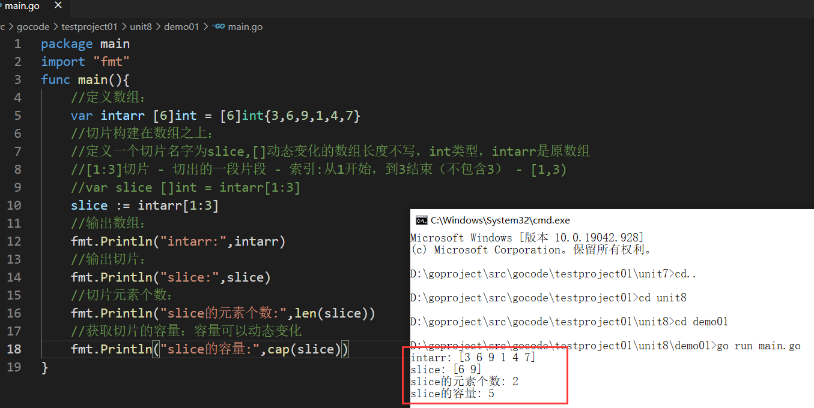
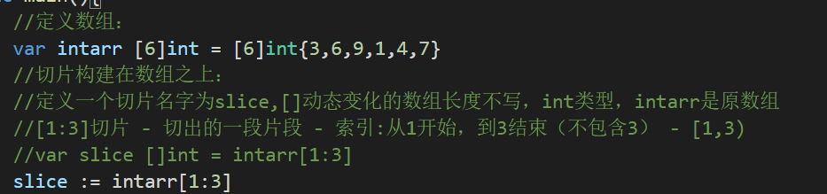
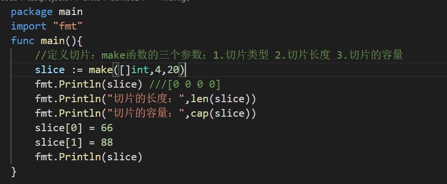
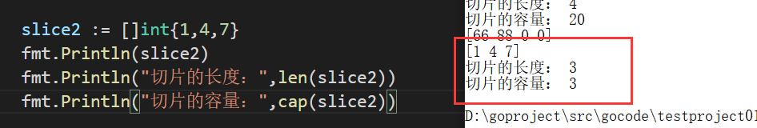
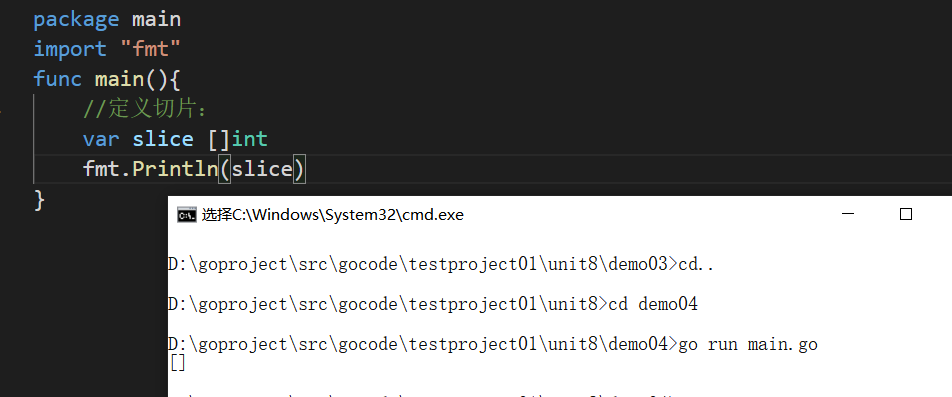
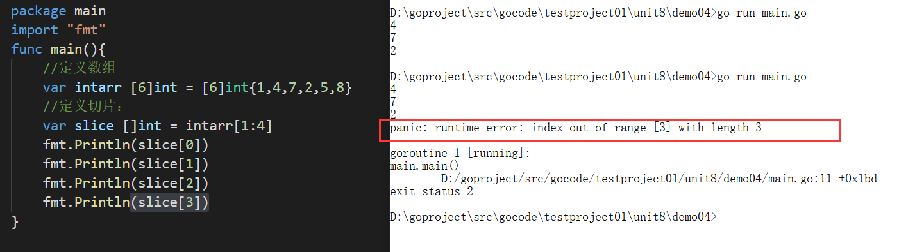
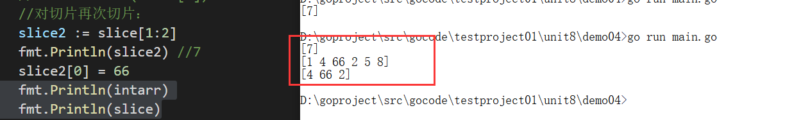
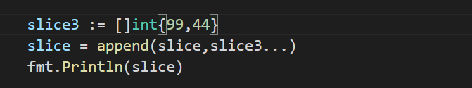

【1】切片(slice)是golang中一种特有的数据类型 \
【2】数组有特定的用处，但是却有一些呆板(数组长度固定不可变)，所以在 Go 语言的代码里并不是特别常见。相对的切片却是随处可见的，切片是一种建立在数组类型之上的抽象，它构建在数组之上并且提供更强大的能力和便捷。 \
【3】切片(slice)是对数组一个连续片段的引用，所以切片是一个引用类型。这个片段可以是整个数组，或者是由起始和终止索引标识的一些项的子集。需要注意的是，终止索引标识的项不包括在切片内。切片提供了一个相关数组的动态窗口。\
【4】代码：
切片的语法：
var 切片名 []类型 = 数组的一个片段引用
 x fd


## 定义切片
【1】方式1：定义一个切片，然后让切片去引用一个已经创建好的数组。

【2】方式2：通过make内置函数来创建切片。基本语法: var切片名[type = make([], len,[cap])

PS : make底层创建一个数组，对外不可见，所以不可以直接操作这个数组，要通过slice去间接的访问各个元素，不可以直接对数组进行维护/操作
【3】方式3：定一个切片，直接就指定具体数组，使用原理类似make的方式。


## 遍历
【1】方式1：for循环常规方式遍历
【2】方式2：for-range 结构遍历切片
```go
package main
import "fmt"
func main(){
        //定义切片：
        slice := make([]int,4,20)
        slice[0] = 66
        slice[1] = 88
        slice[2] = 99
        slice[3] = 100
        //方式1：普通for循环
        for i := 0;i < len(slice);i++ {
                fmt.Printf("slice[%v] = %v \t" ,i,slice[i])
        }
        fmt.Println("\n------------------------------")
        //方式2：for-range循环：
        for i,v := range slice {
                fmt.Printf("下标：%v ，元素：%v\n" ,i,v)
        }
}
```
【1】切片定义后不可以直接使用，需要让其引用到一个数组，或者make一个空间供切片来使用

【2】切片使用不能越界。


【3】简写方式：
1) var slice = arr[0:end]  ----》 var slice = arr[:end]
2) var slice = arr[start:len(arr)]  ----》  var slice = arr[start:]
3) var slice = arr[0:len(arr)]   ----》 var slice = arr[:]

【4】切片可以继续切片  

【5】切片可以动态增长
```go
package main
import "fmt"
func main(){
        //定义数组：
        var intarr [6]int = [6]int{1,4,7,3,6,9}
        //定义切片：
        var slice []int = intarr[1:4] //4,7,3
        fmt.Println(len(slice))
        slice2 := append(slice,88,50)
        fmt.Println(slice2) //[4 7 3 88 50]
        fmt.Println(slice)
        //底层原理：
        //1.底层追加元素的时候对数组进行扩容，老数组扩容为新数组：
        //2.创建一个新数组，将老数组中的4,7,3复制到新数组中，在新数组中追加88,50
        //3.slice2 底层数组的指向 指向的是新数组 
        //4.往往我们在使用追加的时候其实想要做的效果给slice追加：
        slice = append(slice,88,50)
        fmt.Println(slice)
        //5.底层的新数组 不能直接维护，需要通过切片间接维护操作。
}
```
可以通过append函数将切片追加给切片：

【6】切片的拷贝：
```go
package main
import "fmt"
func main(){
        //定义切片：
        var a []int = []int{1,4,7,3,6,9}
        //再定义一个切片：
        var b []int = make([]int,10)
        //拷贝：
        copy(b,a) //将a中对应数组中元素内容复制到b中对应的数组中
        fmt.Println(b)
}
```