```go
package main
import "fmt"
func main(){
        //声明数组：
        var arr [3]int16
        //获取数组的长度：
        fmt.Println(len(arr))
        //打印数组：
        fmt.Println(arr)//[0 0 0]
        //证明arr中存储的是地址值：
        fmt.Printf("arr的地址为：%p",&arr)
        //第一个空间的地址：
        fmt.Printf("arr的地址为：%p",&arr[0])
        //第二个空间的地址：
        fmt.Printf("arr的地址为：%p",&arr[1])
        //第三个空间的地址：
        fmt.Printf("arr的地址为：%p",&arr[2])
}
```
运行结果：
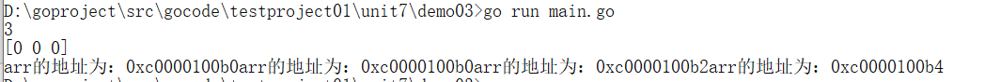
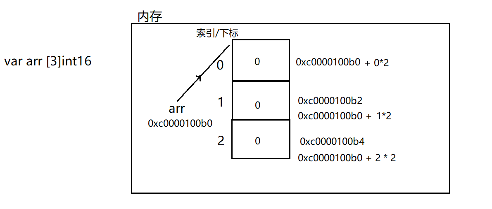
PS : 数组每个空间占用的字节数取决于数组类型

【3】赋值内存：（数组是值类型，在栈中开辟内存）
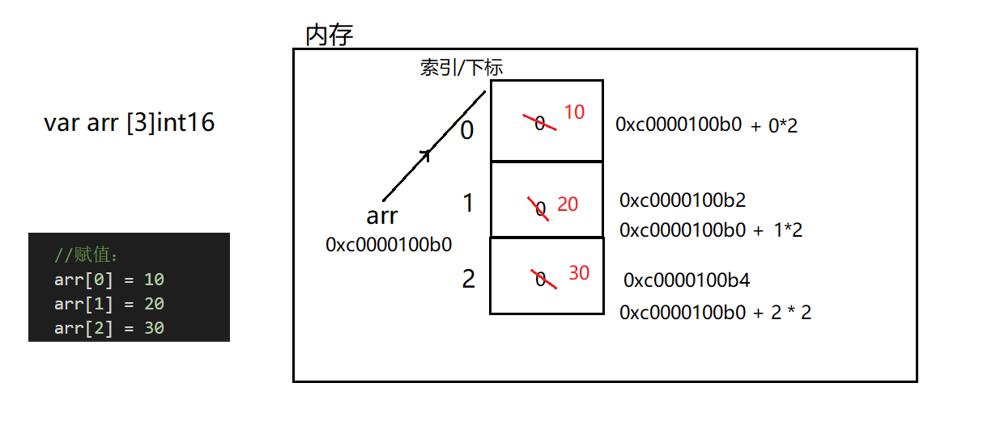
数组优点：访问/查询/读取 速度快
## 初始化
```go
package main
import "fmt"
func main(){
        //第一种：
        var arr1 [3]int = [3]int{3,6,9}
        fmt.Println(arr1)
        //第二种：
        var arr2 = [3]int{1,4,7}
        fmt.Println(arr2)
        //第三种：
        var arr3 = [...]int{4,5,6,7}
        fmt.Println(arr3)
        //第四种：
        var arr4 = [...]int{2:66,0:33,1:99,3:88}
        fmt.Println(arr4)
}
```


## 数组的遍历
【1】普通for循环
【2】键值循环
（键值循环） for range结构是Go语言特有的一种的迭代结构，在许多情况下都非常有用，for range 可以遍历数组、切片、字符串、map 及通道，for range 语法上类似于其它语言中的 foreach 语句，一般形式为：\
```
for key, val := range coll {
...
}
```

注意：
（1）coll就是你要的数组 \
（2）每次遍历得到的索引用key接收，每次遍历得到的索引位置上的值用val \
（3）key、value的名字随便起名  k、v   key、value  \
（4）key、value属于在这个循环中的局部变量 \
（5）你想忽略某个值：用_就可以了： \
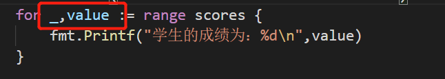
```go

package main
import "fmt"
func main(){
        //实现的功能：给出五个学生的成绩，求出成绩的总和，平均数：
        //给出五个学生的成绩：--->数组存储：
        //定义一个数组：
        var scores [5]int
        //将成绩存入数组：(循环 + 终端输入)
        for i := 0; i < len(scores);i++ {//i：数组的下标
                fmt.Printf("请录入第个%d学生的成绩",i + 1)
                fmt.Scanln(&scores[i])
        }
        //展示一下班级的每个学生的成绩：（数组进行遍历）
        //方式1：普通for循环：
        for i := 0; i < len(scores);i++ {
                fmt.Printf("第%d个学生的成绩为：%d\n",i+1,scores[i])
        }
        fmt.Println("-------------------------------")
        //方式2：for-range循环
        for key,value := range scores {
                fmt.Printf("第%d个学生的成绩为：%d\n",key + 1,value)
        }
}

```
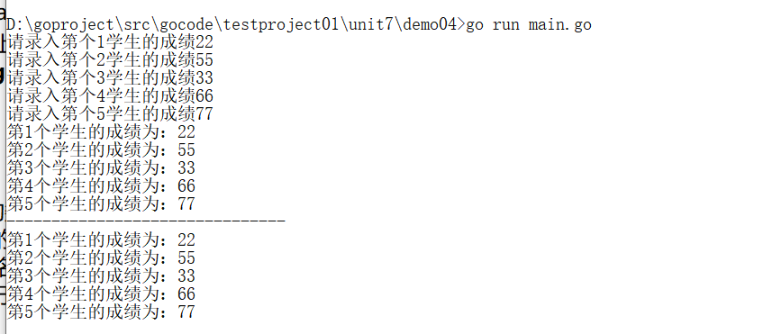

## 二维数组
【1】二维数组的定义，并且有默认初始值：
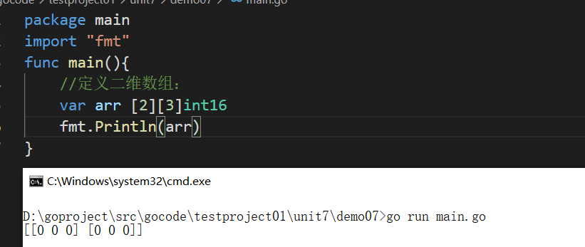
【2】二维数组内存：
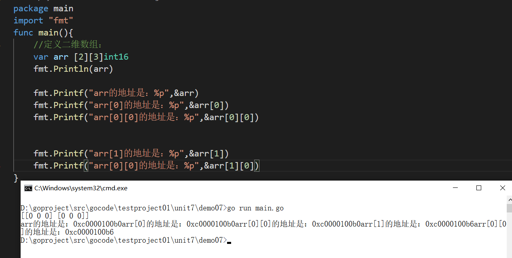
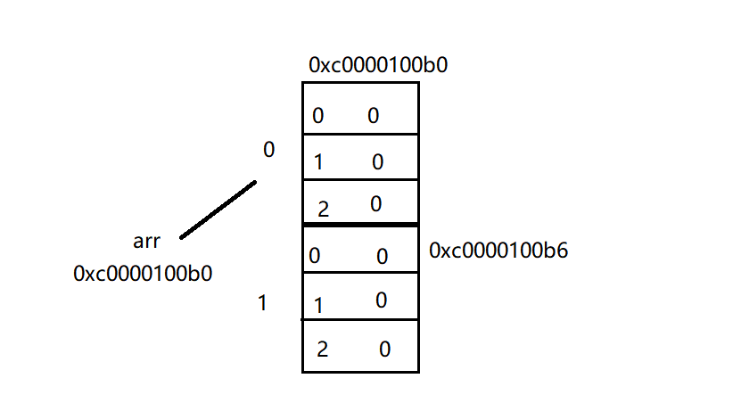

【3】赋值操作：
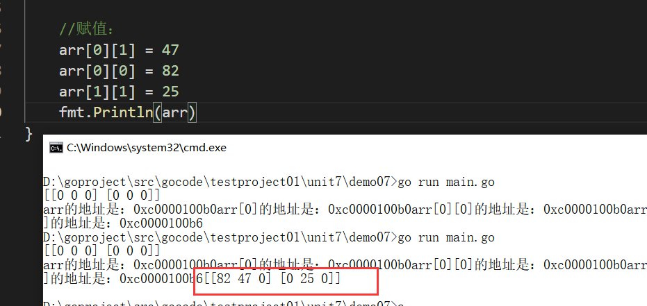

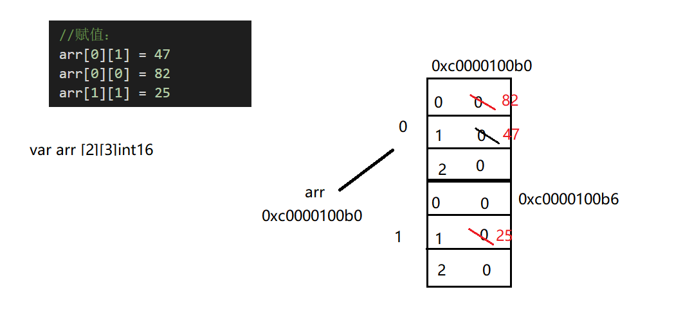

【4】二维数组的初始化：
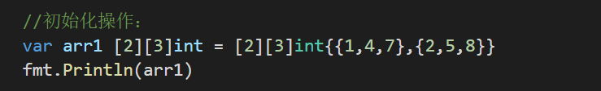
## 二维数组遍历
【1】普通for循环
【2】键值循环（for range）


代码：
```go
package main
import "fmt"
func main(){
        //定义二维数组：
        var arr [3][3]int = [3][3]int{{1,4,7},{2,5,8},{3,6,9}}
        fmt.Println(arr)
        fmt.Println("------------------------")
        //方式1：普通for循环：
        for i := 0;i < len(arr);i++{
                for j := 0;j < len(arr[i]);j++ {
                        fmt.Print(arr[i][j],"\t")
                }
                fmt.Println()
        }
        fmt.Println("------------------------")
        //方式2：for range循环：
        for key,value := range arr {
                for k,v := range value {
                        fmt.Printf("arr[%v][%v]=%v\t",key,k,v)
                }
                fmt.Println()
        }
}
```

## 注意
【1】长度属于类型的一部分 ：
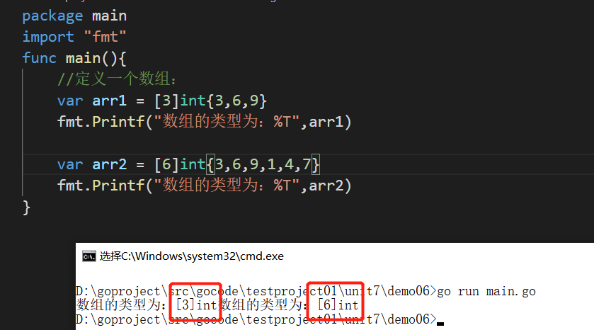

【2】Go中数组属值类型，在默认情况下是值传递，因此会进行值拷贝。
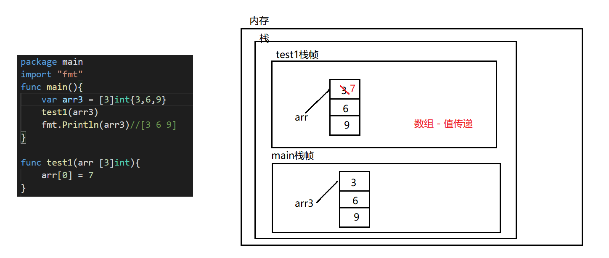

【3】如想在其它函数中，去修改原来的数组，可以使用引用传递(指针方式)。

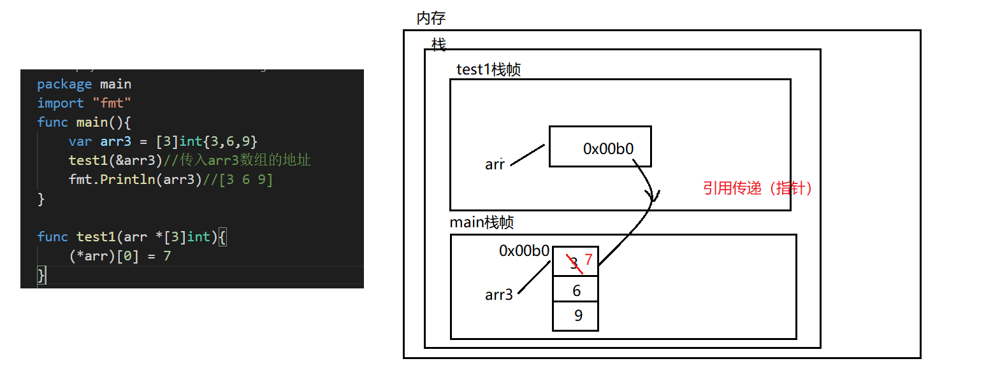
