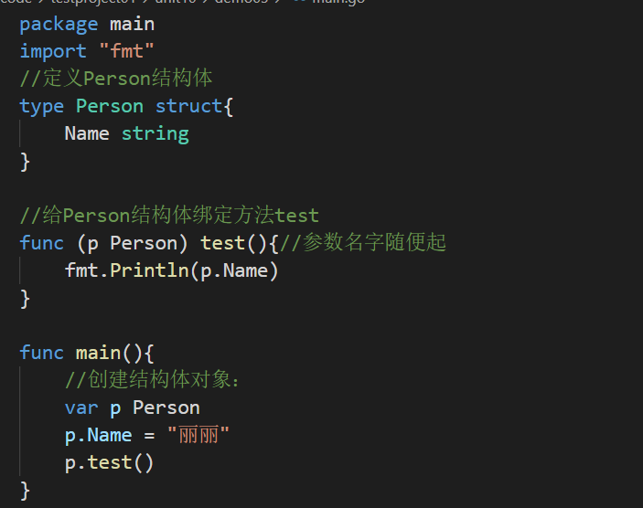
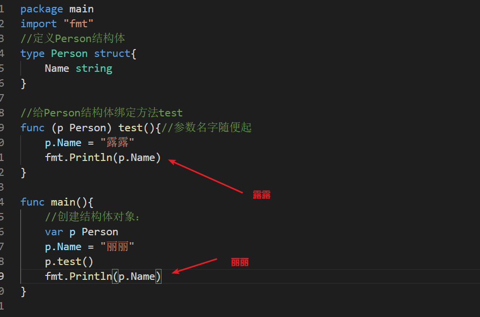
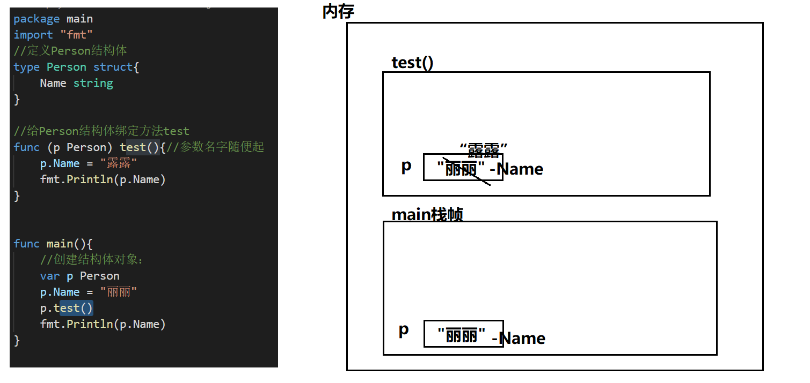
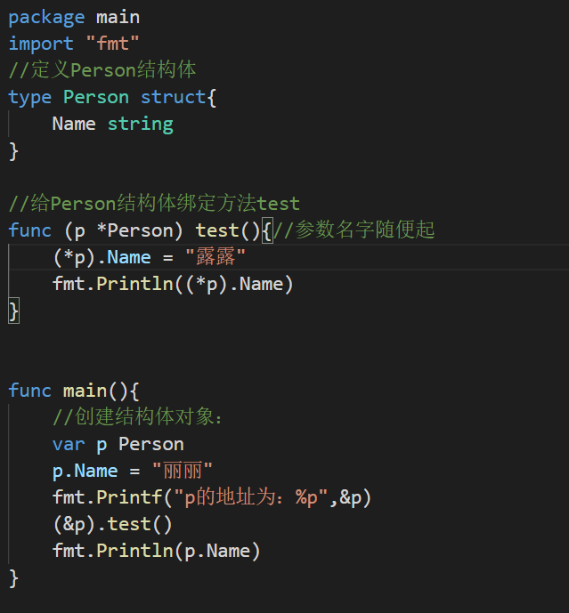
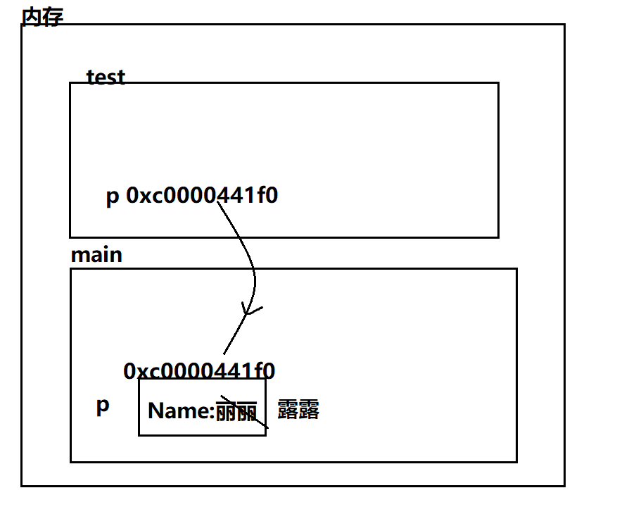
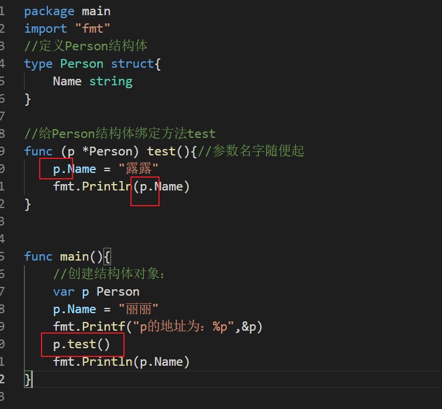

【1】方法是作用在指定的数据类型上、和指定的数据类型绑定，因此自定义类型，都可以有方法，而不仅仅是struct

【2】方法的声明和调用格式：

声明：
```go
type A struct {
                Num int
}
func (a A) test() {
                fmt.Println(a.Num)
}
```
调用：

var a A

a.test()

（1）func (a A) test()相当于A结构体有一个方法叫test

（2）(a A)体现方法test和结构体A绑定关系

【3】代码层面：

注意：

（1）test方法中参数名字随意起

（2）结构体Person和test方法绑定，调用test方法必须靠指定的类型：Person

（3）如果其他类型变量调用test方法一定会报错。

（4）结构体对象传入test方法中，值传递，和函数参数传递一致。

（1）结构体类型是值类型，在方法调用中，遵守值类型的传递机制，是值拷贝传递方式

（2）如程序员希望在方法中，改变结构体变量的值，可以通过结构体指针的方式来处理



我们写程序的时候，可以直接简化：


底层编译器做了优化，底层会自动帮我们加上 &  *


（3）Golang中的方法作用在指定的数据类型上的，和指定的数据类型绑定，因此自定义类型，都可以有方法，而不仅仅是struct，比如int , float32等都可以有方法
```go
package main
import "fmt"
type integer int
func (i integer) print(){
        i = 30
        fmt.Println("i = ",i)
}
func (i *integer) change(){
        *i = 30
        fmt.Println("i = ",*i)
}
func main(){
        var i integer = 20
        i.print()
        i.change()
        fmt.Println(i)
}
```
（4）方法的访问范围控制的规则，和函数一样。方法名首字母小写，只能在本包访问，方法首字母大写，可以在本包和其它包访问。

（5）如果一个类型实现了String()这个方法，那么fmt.Println默认会调用这个变量的String()进行输出

以后定义结构体的话，常定义String()作为输出结构体信息的方法，在fmt.Println会自动调用
```go
package main
import "fmt"
type Student struct{
        Name string
        Age int
}
func (s *Student) String() string{
        str := fmt.Sprintf("Name = %v , Age = %v",s.Name,s.Age)
        return str
}
func main(){
        stu := Student{
                Name : "丽丽",
                Age : 20,
        }
        //传入地址，如果绑定了String方法就会自动调用
        fmt.Println(&stu)
}
```

## 方法和函数的区别
【1】绑定指定类型：
方法：需要绑定指定数据类型
函数：不需要绑定数据类型

【2】调用方式不一样：
函数的调用方式:
函数名(实参列表)
方法的调用方式：变量.方法名(实参列表)
```go
package main
import "fmt"
type Student struct{
        Name string
}
//定义方法：
func (s Student) test01(){
        fmt.Println(s.Name)
}
//定义函数：
func method01(s Student){
        fmt.Println(s.Name)
}
func main(){
        //调用函数：
        var s Student = Student{"丽丽"}
        method01(s)
        //方法调用：
        s.test01()
}

```
【3】对于函数来说，参数类型对应是什么就要传入什么。
```go
package main
import "fmt"
type Student struct{
        Name string
}
//定义函数：
func method01(s Student){
        fmt.Println(s.Name)
}
func method02(s *Student){
        fmt.Println((*s).Name)
}
func main(){
        var s Student = Student{"丽丽"}
        method01(s)
        //method01(&s)错误
        method02(&s)
        //method02(s)错误
}
```
【4】对于方法来说，接收者为值类型，可以传入指针类型，接受者为指针类型，可以传入值类型。
```go
package main
import "fmt"
type Student struct{
        Name string
}
//定义方法：
func (s Student) test01(){
        fmt.Println(s.Name)
}
func (s *Student) test02(){
        fmt.Println((*s).Name)
}
func main(){
        var s Student = Student{"丽丽"}
        s.test01()
        (&s).test01()//虽然用指针类型调用，但是传递还是按照值传递的形式
        (&s).test02()
        s.test02()//等价
}
```