## 文件
【1】文件是什么？

文件是保存数据的地方，是数据源的一种，比如大家经常使用的word文档、txt文件、excel文件、jpg文件...都是文件。文件最主要的作用就是保存数据，它既可以保存一张图片，也可以保持视频，声音...

【2】os包下的File结构体封装了对文件的操作：
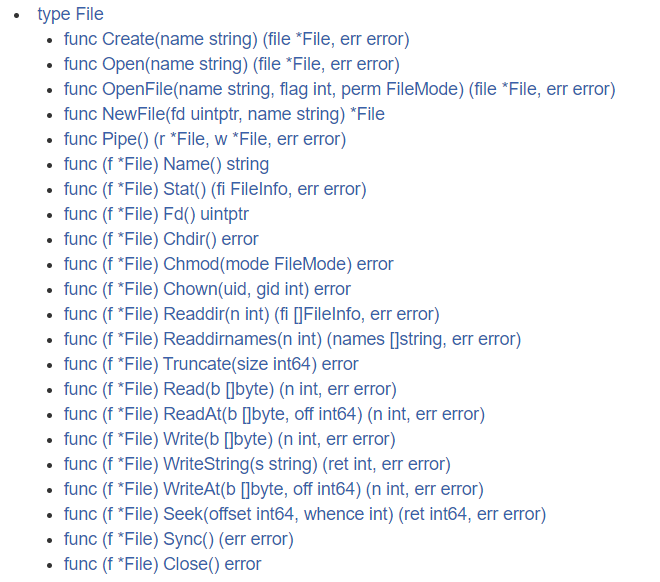
【3】File结构体---打开文件和关闭文件：

（1）打开文件，用于读取：（函数）
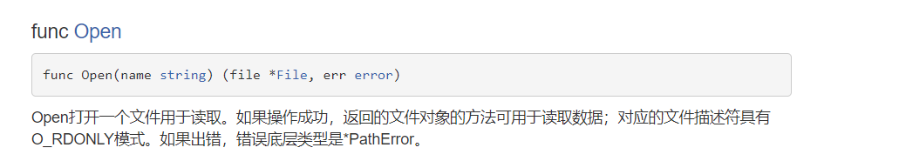

传入一个字符串（文件的路径），返回的是文件的指针，和是否打开成功

（2）关闭文件：（方法）
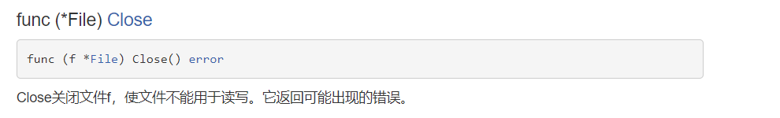
使文件不能用于读写。它返回可能出现的错误

【4】案例：
```go
package main
import(
        "fmt"
        "os"
)
func main(){
        //打开文件：
        file,err := os.Open("d:/Test.txt");
        if err != nil {//出错
                fmt.Println("文件打开出错，对应错误为：",err)
        }
        //没有出错，输出文件：
        fmt.Printf("文件=%v",file)
        //.........一系列操作
        //关闭文件：
        err2 := file.Close();
        if err2 != nil {
                fmt.Println("关闭失败")
        }
}

```
【1】IO流对文件进行操作：
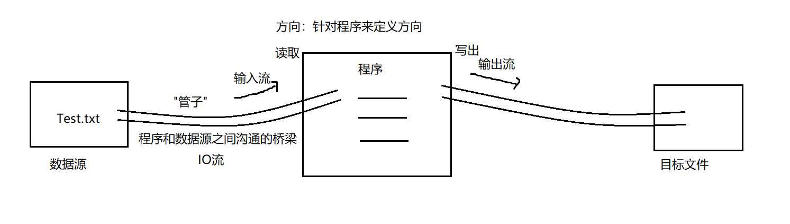

【1】读取文件的内容并显示在终端(使用ioutil一次将整个文件读入到内存中)，这种方式适用于文件不大的情况。相关方法和函数(ioutil.ReadFile)

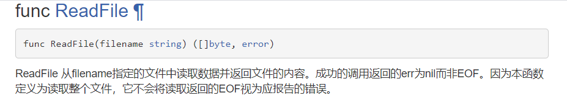

```go
package main
import(
        "fmt"
        "io/ioutil"
)
func main(){
        //备注：在下面的程序中不需要进行 Open\Close操作，因为文件的打开和关闭操作被封装在ReadFile函数内部了
        //读取文件：
        content,err := ioutil.ReadFile("d:/Test.txt")//返回内容为：[]byte,err
        if err != nil {//读取有误
                fmt.Println("读取出错，错误为：",err)
        }
        //如果读取成功，将内容显示在终端即可：
        //fmt.Printf("%v",content)
        fmt.Printf("%v",string(content))
}
```

【1】读取文件的内容并显示在终端(带缓冲区的方式-4096字节)，适合读取比较大的文件，使用os.Open,file.Close,bufio.NewReader(),reader.ReadString函数和方法
```go
package main
import(
        "fmt"
        "os"
        "bufio"
        "io"
)
func main(){
        //打开文件：
        file,err := os.Open("d:/Test.txt")
        if err != nil {//打开失败
                fmt.Println("文件打开失败，err=",err)
        }
        //当函数退出时，让file关闭，防止内存泄露：
        defer file.Close()
        //创建一个流：
        reader := bufio.NewReader(file)
        //读取操作：
        for {
                str,err := reader.ReadString('\n')//读取到一个换行就结束
                //如果没有读取到文件结尾的话，就正常输出文件内容即可：
                fmt.Println(str)
                if err == io.EOF {//io.EOF 表示已经读取到文件的结尾
                        break
                }
                
        }
        //结束：
        fmt.Println("文件读取成功，并且全部读取完毕")
}
```

【1】打开文件操作：

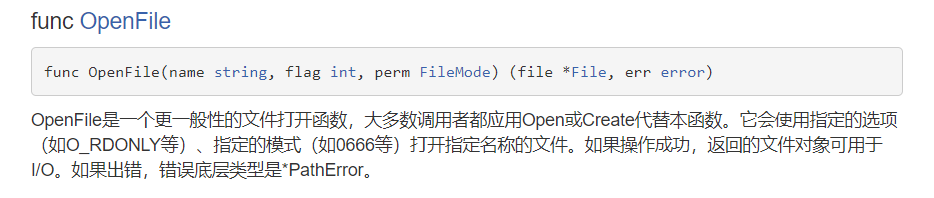
三个参数含义：
（1）要打开的文件的路径

（2）文件打开模式（可以利用"|"符号进行组合）
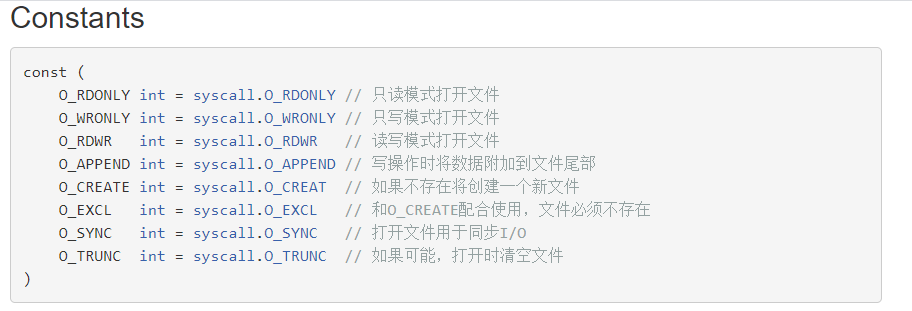

（3）权限控制（linux/unix系统下才生效，windows下设置无效）- 0666

【2】案例：
```go
package main
import(
        "fmt"
        "os"
        "bufio"
)
func main(){
        //写入文件操作：
        //打开文件：
        file , err := os.OpenFile("d:/Demo.txt",os.O_RDWR | os.O_APPEND | os.O_CREATE,0666)
        if err != nil {//文件打开失败
                fmt.Printf("打开文件失败",err)
                return
        }
        //及时将文件关闭：
        defer file.Close()
        //写入文件操作：---》IO流---》缓冲输出流(带缓冲区)
        writer := bufio.NewWriter(file)
        for i := 0; i < 10;i++ {
                writer.WriteString("你好 马士兵\n")
        } 
        //流带缓冲区，刷新数据--->真正写入文件中：
        writer.Flush()
        s :=os.FileMode(0666).String()
        fmt.Println(s)
}
```

案例

```go
package main
import(
        "fmt"
        "io/ioutil"
)
func main(){
        //定义源文件：
        file1Path := "d:/Demo.txt"
        //定义目标文件：
        file2Path := "d:/Demo2.txt"
        //对文件进行读取：
        content,err := ioutil.ReadFile(file1Path)
        if err != nil {
                fmt.Println("读取有问题!")
                return
        }
        //写出文件：
        err = ioutil.WriteFile(file2Path,content,0666)
        if err != nil {
                fmt.Println("写出失败！")
        }
}
```

## 协程
【1】程序(program)
是为完成特定任务、用某种语言编写的一组指令的集合,是一段静态的代码。 （程序是静态的）

【2】进程(process)
是程序的一次执行过程。正在运行的一个程序，进程作为资源分配的单位，在内存中会为每个进程分配不同的内存区域。 （进程是动态的）是一个动的过程 ，进程的生命周期  :  有它自身的产生、存在和消亡的过程 


【3】线程(thread)
进程可进一步细化为线程， 是一个程序内部的一条执行路径。
若一个进程同一时间并行执行多个线程，就是支持多线程的。 
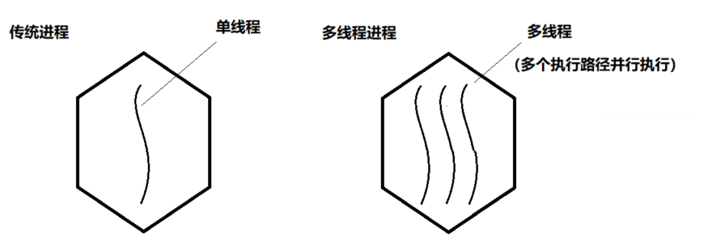
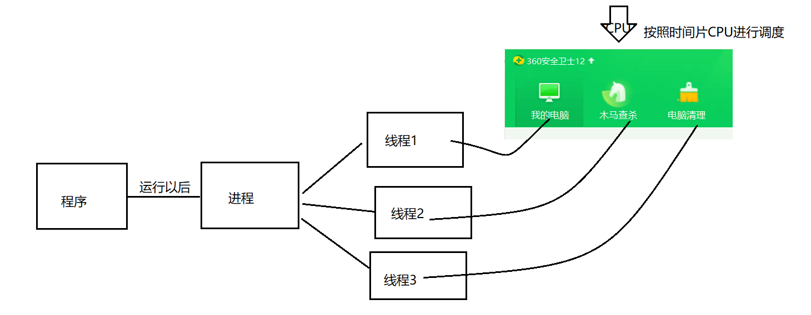
【4】协程(goroutine)
又称为微线程，纤程，协程是一种用户态的轻量级线程

作用:在执行A函数的时候，可以随时中断，去执行B函数，然后中断继续执行A函数(可以自动切换)，注意这一切换过程并不是函数调用（没有调用语句)，过程很像多线程，然而协程中只有一个线程在执行（协程的本质是个单线程）


对于单线程下，我们不可避免程序中出现io操作，但如果我们能在自己的程序中(即用户程序级别，而非操作系统级别)控制单线程下的多个任务能在一个任务遇到io阻塞时就将寄存器上下文和栈保存到某个其他地方，然后切换到另外一个任务去计算。在任务切回来的时候，恢复先前保存的寄存器上下文和栈，这样就保证了该线程能够最大限度地处于就绪态，即随时都可以被cpu执行的状态，相当于我们在用户程序级别将自己的io操作最大限度地隐藏起来，从而可以迷惑操作系统，让其看到：该线程好像是一直在计算，io比较少，从而会更多的将cpu的执行权限分配给我们的线程（注意:线程是CPU控制的，而协程是程序自身控制的，属

### 入门
【1】案例：

请编写一个程序，完成如下功能:

（1）在主线程中，开启一个goroutine，该goroutine每隔1秒输出"hello golang"

（2）在主线程中也每隔一秒输出"hello msb"，输出10次后，退出程序

（3）要求主线程和goroutine同时执行
```go
package main
import(
        "fmt"
        "strconv"
        "time"
)
func test(){
        for i := 1;i <= 10;i++ {
                fmt.Println("hello golang + " + strconv.Itoa(i))
                //阻塞一秒：
                time.Sleep(time.Second)
        }
}
func main(){//主线程
        go test() //开启一个协程
        for i := 1;i <= 10;i++ {
                fmt.Println("hello msb + " + strconv.Itoa(i))
                //阻塞一秒：
                time.Sleep(time.Second)
        }
}
```
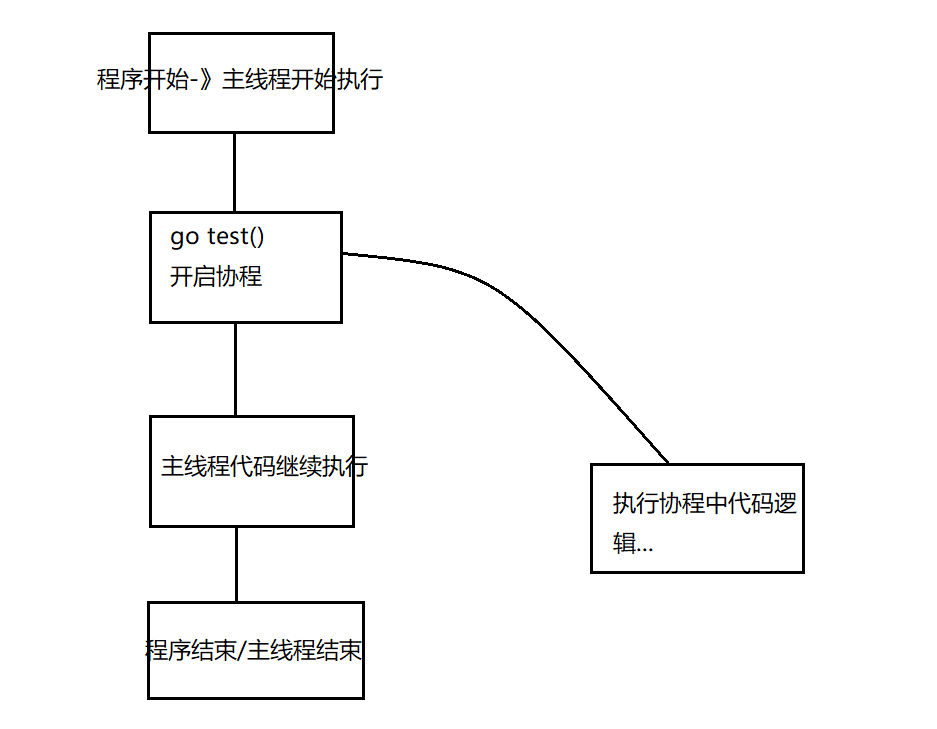
【1】主死从随：
1) 如果主线程退出了，则协程即使还没有执行完毕，也会退出
2) 当然协程也可以在主线程没有退出前，就自己结束了，比如完成了自己的任务
```go
package main
import(
        "fmt"
        "strconv"
        "time"
)
func test(){
        for i := 1;i <= 1000;i++ {
                fmt.Println("hello golang + " + strconv.Itoa(i))
                //阻塞一秒：
                time.Sleep(time.Second)
        }
}
func main(){//主线程
        go test() //开启一个协程
        for i := 1;i <= 10;i++ {
                fmt.Println("hello msb + " + strconv.Itoa(i))
                //阻塞一秒：
                time.Sleep(time.Second)
        }
}

```
启动多个协程
```go
package main
import(
        "fmt"
        "time"
)
func main(){
        //匿名函数+外部变量 = 闭包
        for i := 1;i <= 5;i++ {
                //启动一个协程
                //使用匿名函数，直接调用匿名函数
                go func(n int){
                        fmt.Println(n)
                }(i)
        }
        time.Sleep(time.Second * 2)
}
```

【1】WaitGroup的作用：
WaitGroup用于等待一组线程的结束。父线程调用Add方法来设定应等待的线程的数量。每个被等待的线程在结束时应调用Done方法。同时，主线程里可以调用Wait方法阻塞至所有线程结束。---》解决主线程在子协程结束后自动结束

【2】主要方法：

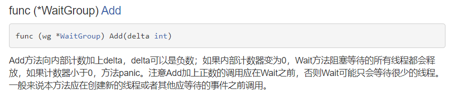
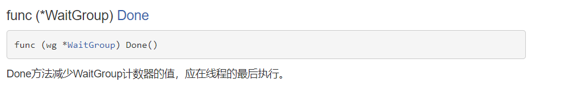
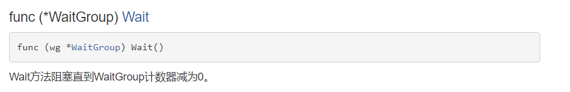

【3】案例：

（1）Add\Done\Wait:
```go
package main
import(
        "fmt"
        "sync"
)
var wg sync.WaitGroup //只定义无需赋值
func main(){
        //启动五个协程
        for i := 1 ;i <= 5;i++ {
                wg.Add(1) //协程开始的时候加1操作
                go func(n int){
                        fmt.Println(n)
                        wg.Done()  //协程执行完成减1
                }(i)
        }
        //主线程一直在阻塞，什么时候wg减为0了，就停止
        wg.Wait()
}
```
（2）如果防止忘记计数器减1操作，结合defer关键字使用：
```go
package main
import(
        "fmt"
        "sync"
)
var wg sync.WaitGroup //只定义无需赋值
func main(){
        //启动五个协程
        for i := 1 ;i <= 5;i++ {
                wg.Add(1) //协程开始的时候加1操作
                go func(n int){
                        defer wg.Done()
                        fmt.Println(n)		
                }(i)
        }
        //主线程一直在阻塞，什么时候wg减为0了，就停止
        wg.Wait()
}
```
（3）可以最开始在知道协程次数的情况下先Add操作：

```go
package main
import(
        "fmt"
        "sync"
)
var wg sync.WaitGroup //只定义无需赋值
func main(){
        wg.Add(5)
        //启动五个协程
        for i := 1 ;i <= 5;i++ {
                go func(n int){
                        defer wg.Done()
                        fmt.Println(n)		
                }(i)
        }
        //主线程一直在阻塞，什么时候wg减为0了，就停止
        wg.Wait()
}
```
注意：Add中加入的数字和协程的次数一定要保持一致
### 多个协程
【1】案例：多个协程操纵同一数据  
```go
package main
import(
        "fmt"
        "sync"
)
//定义一个变量：
var totalNum int
var wg sync.WaitGroup //只定义无需赋值
func add(){
        defer wg.Done()
        for i := 0 ;i < 100000;i++{
                totalNum = totalNum + 1
        }
}
func sub(){
        defer wg.Done()
        for i := 0 ;i < 100000;i++{
                totalNum = totalNum - 1
        }
}
func main(){
        wg.Add(2)
        //启动协程
        go add()
        go sub()
        wg.Wait()
        fmt.Println(totalNum)
}
```
结果：在理论上，这个totalNum结果应该是0 ，无论协程怎么交替执行，最终想象的结果就是0
但是事实上：不是
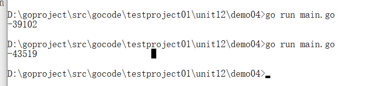
问题出现的原因：（图解为其中一种可能性）
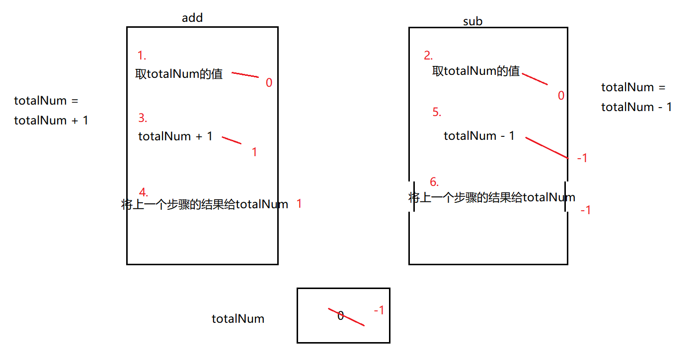


解决问题：
有一个机制：确保：一个协程在执行逻辑的时候另外的协程不执行
----》锁的机制---》加入互斥锁
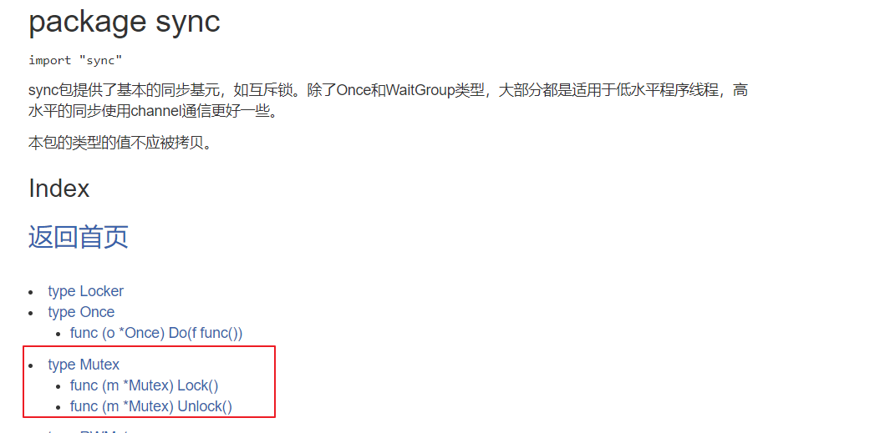
```go
package main
import(
        "fmt"
        "sync"
)
//定义一个变量：
var totalNum int
var wg sync.WaitGroup //只定义无需赋值
//加入互斥锁：
var lock sync.Mutex
func add(){
        defer wg.Done()
        for i := 0 ;i < 100000;i++{
                //加锁
                lock.Lock()
                totalNum = totalNum + 1
                //解锁：
                lock.Unlock()
        }
}
func sub(){
        defer wg.Done()
        for i := 0 ;i < 100000;i++{
                //加锁
                lock.Lock()
                totalNum = totalNum - 1
                //解锁：
                lock.Unlock()
        }
}
func main(){
        wg.Add(2)
        //启动协程
        go add()
        go sub()
        wg.Wait()
        fmt.Println(totalNum)
}
```

golang中sync包实现了两种锁Mutex （互斥锁）和RWMutex（读写锁）
【1】互斥锁

其中Mutex为互斥锁，Lock()加锁，Unlock()解锁，使用Lock()加锁后，便不能再次对其进行加锁，直到利用Unlock()解锁对其解锁后，才能再次加锁．适用于读写不确定场景，即读写次数没有明显的区别
----性能、效率相对来说比较低

【2】读写锁
RWMutex是一个读写锁，其经常用于读次数远远多于写次数的场景．

---在读的时候，数据之间不产生影响，   写和读之间才会产生影响


【3】案例：
```go
package main
import(
        "fmt"
        "sync"
        "time"
)
var wg sync.WaitGroup //只定义无需赋值
//加入读写锁：
var lock sync.RWMutex
func read(){
        defer wg.Done()
        lock.RLock()//如果只是读数据，那么这个锁不产生影响，但是读写同时发生的时候，就会有影响
        fmt.Println("开始读取数据")
        time.Sleep(time.Second)
        fmt.Println("读取数据成功")
        lock.RUnlock()
}
func write(){
        defer wg.Done()
        lock.Lock()
        fmt.Println("开始修改数据")
        time.Sleep(time.Second * 10)
        fmt.Println("修改数据成功")
        lock.Unlock()
}
func main(){
        wg.Add(6)
        //启动协程 ---> 场合：读多写少
        for i := 0;i < 5;i++ {
                go read()
        }
        go write()
        wg.Wait()
}
```
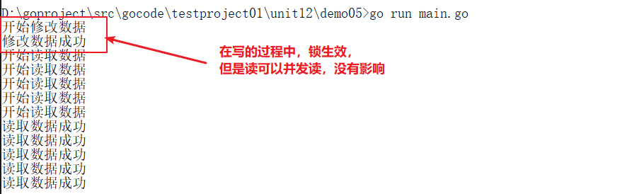


## 管道
【1】管道（channel）特质介绍：
（1）管道本质就是一个数据结构-队列
（2）数据是先进先出
（3）自身线程安全，多协程访问时，不需要加锁，channel本身就是线程安全的
（4）管道有类型的，一个string的管道只能存放string类型数据
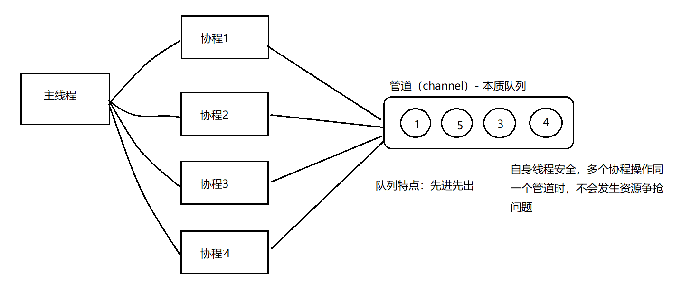

【1】管道的定义：
var  变量名  chan  数据类型
PS1：chan管道关键字
PS2：数据类型指的是管道的类型，里面放入数据的类型，管道是有类型的，int类型的管道只能写入整数int
PS3：管道是引用类型，必须初始化才能写入数据，即make后才能使用

【2】案例：

```go
package main
import(
        "fmt"
)
func main(){
        //定义管道 、 声明管道 ---> 定义一个int类型的管道
        var intChan chan int
        //通过make初始化：管道可以存放3个int类型的数据
        intChan = make(chan int,3)
        //证明管道是引用类型：
        fmt.Printf("intChan的值：%v",intChan) // 0xc000112080
        //向管道存放数据：
        intChan<- 10
        num := 20
        intChan<- num
        intChan<- 40  
        //注意：不能存放大于容量的数据：
        //intChan<- 80  
        //在管道中读取数据：
        num1 := <-intChan
        num2 := <-intChan
        num3 := <-intChan
        fmt.Println(num1)
        fmt.Println(num2)
        fmt.Println(num3)
        //注意：在没有使用协程的情况下，如果管道的数据已经全部取出，那么再取就会报错：
        num4 := <-intChan
        fmt.Println(num4)
        //输出管道的长度：
        fmt.Printf("管道的实际长度：%v,管道的容量是：%v",len(intChan),cap(intChan))
}
```
【1】管道的关闭：
使用内置函数close可以关闭管道，当管道关闭后，就不能再向管道写数据了，但是仍然可以从该管道读取数据。
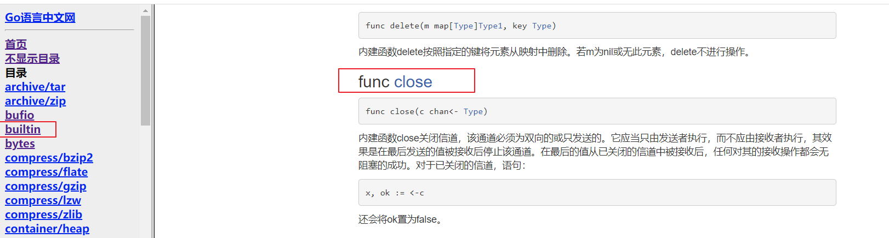
```go
package main
import(
        "fmt"
)
func main(){
        //定义管道 、 声明管道
        var intChan chan int
        //通过make初始化：管道可以存放3个int类型的数据
        intChan = make(chan int,3)
        //在管道中存放数据：
        intChan<- 10
        intChan<- 20
        //关闭管道：
        close(intChan)
        //再次写入数据：--->报错
        //intChan<- 30
        //当管道关闭后，读取数据是可以的：
        num := <- intChan
        fmt.Println(num)
}
```
【1】管道的遍历：
管道支持for-range的方式进行遍历，请注意两个细节
1)在遍历时，如果管道没有关闭，则会出现deadlock的错误
2)在遍历时，如果管道已经关闭，则会正常遍历数据，遍历完后，就会退出遍历。

【2】案例：
```go
package main
import(
        "fmt"
)
func main(){
        //定义管道 、 声明管道
        var intChan chan int
        //通过make初始化：管道可以存放3个int类型的数据
        intChan = make(chan int,100)
        for i := 0;i < 100;i++ {
                intChan<- i
        }
        //在遍历前，如果没有关闭管道，就会出现deadlock的错误
        //所以我们在遍历前要进行管道的关闭
        close(intChan)
        //遍历：for-range
        for v := range intChan {
                fmt.Println("value = ",v)
        }
}
```

【1】案例需求：
请完成协程和管道协同工作的案例，具体要求:
1) 开启一个writeData协程，向管道中写入50个整数.
2) 开启一个readData协程，从管道中读取writeData写入的数据。
3) 注意: writeData和readDate操作的是同一个管道
4) 主线程需要等待writeData和readDate协程都完成工作才能退出

【2】原理图：
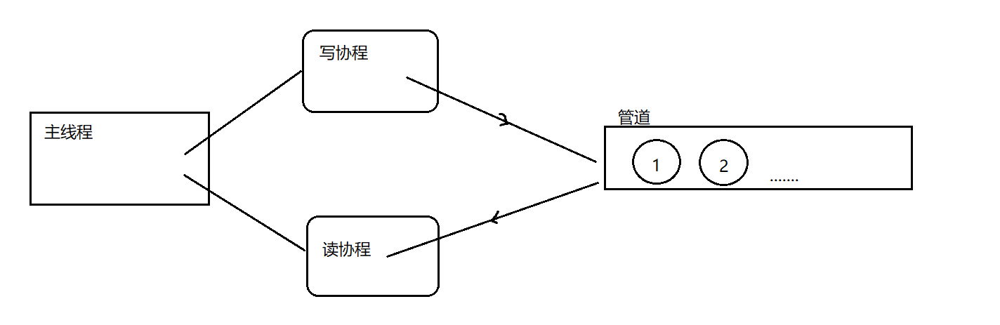
```go
package main
import(
        "fmt"
        "time"
        "sync"
)
var wg sync.WaitGroup //只定义无需赋值
//写：
func writeData(intChan chan int){
        defer wg.Done()
        for i := 1;i <= 50;i++{
                intChan<- i
                fmt.Println("写入的数据为：",i)
                time.Sleep(time.Second)
        }
        //管道关闭：
        close(intChan)
}
//读：
func readData(intChan chan int){
        defer wg.Done()
        //遍历：
        for v := range intChan{
                fmt.Println("读取的数据为：",v)
                time.Sleep(time.Second)
        }
}
func main(){//主线程
        //写协程和读协程共同操作同一个管道-》定义管道：
        intChan := make(chan int,50)
        wg.Add(2)
        //开启读和写的协程：
        go writeData(intChan)
        go readData(intChan)
        //主线程一直在阻塞，什么时候wg减为0了，就停止
        wg.Wait()	
}
```
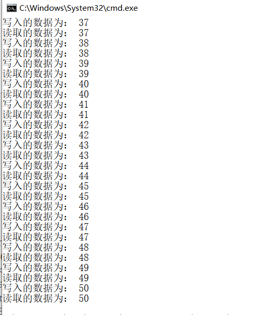
【1】管道可以声明为只读或者只写性质
【2】代码：
```go
package main
import(
        "fmt"
)
func main(){
        //默认情况下，管道是双向的--》可读可写：
        //var intChan1 chan int
        //声明为只写：
        var intChan2 chan<- int  // 管道具备<- 只写性质
        intChan2 = make(chan int,3)
        intChan2<- 20
        //num := <-intChan2 报错
        fmt.Println("intChan2:",intChan2)
        //声明为只读：
        var intChan3 <-chan int// 管道具备<- 只读性质 
        if intChan3 != nil {
                num1 := <-intChan3
                fmt.Println("num1:",num1)
        }
        //intChan3<- 30 报错
        
}
```

【1】当管道只写入数据，没有读取，就会出现阻塞：

```go
package main
import(
        "fmt"
        _"time"
        "sync"
)
var wg sync.WaitGroup //只定义无需赋值
//写：
func writeData(intChan chan int){
        defer wg.Done()
        for i := 1;i <= 10;i++{
                intChan<- i
                fmt.Println("写入的数据为：",i)
                //time.Sleep(time.Second)
        }
        //管道关闭：
        close(intChan)
}
//读：
func readData(intChan chan int){
        defer wg.Done()
        //遍历：
        for v := range intChan{
                fmt.Println("读取的数据为：",v)
                //time.Sleep(time.Second)
        }
}
func main(){//主线程
        //写协程和读协程共同操作同一个管道-》定义管道：
        intChan := make(chan int,10)
        wg.Add(2)
        //开启读和写的协程：
        go writeData(intChan)
        //go readData(intChan)
        //主线程一直在阻塞，什么时候wg减为0了，就停止
        wg.Wait()	
}

```
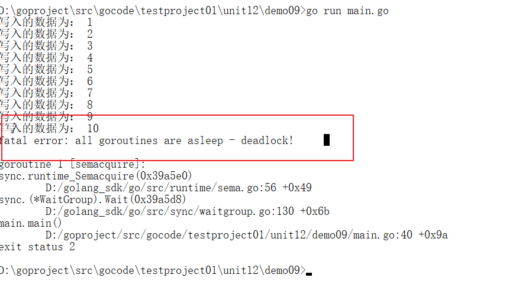
【2】写的快，读的满（管道读写频率不一致），不会出现阻塞问题：

```go
package main
import(
        "fmt"
        "time"
        "sync"
)
var wg sync.WaitGroup //只定义无需赋值
//写：
func writeData(intChan chan int){
        defer wg.Done()
        for i := 1;i <= 10;i++{
                intChan<- i
                fmt.Println("写入的数据为：",i)
                //time.Sleep(time.Second)
        }
        //管道关闭：
        close(intChan)
}
//读：
func readData(intChan chan int){
        defer wg.Done()
        //遍历：
        for v := range intChan{
                fmt.Println("读取的数据为：",v)
                time.Sleep(time.Second)
        }
}
func main(){//主线程
        //写协程和读协程共同操作同一个管道-》定义管道：
        intChan := make(chan int,10)
        wg.Add(2)
        //开启读和写的协程：
        go writeData(intChan)
        go readData(intChan)
        //主线程一直在阻塞，什么时候wg减为0了，就停止
        wg.Wait()	
}
```

【1】select功能：解决多个管道的选择问题，也可以叫做多路复用，可以从多个管道中随机公平地选择一个来执行
PS：case后面必须进行的是io操作，不能是等值，随机去选择一个io操作
PS：default防止select被阻塞住，加入default


【2】代码：
```go
package main
import(
        "fmt"
        "time"
)
func main(){
        //定义一个int管道：
        intChan := make(chan int,1)
        go func(){
                time.Sleep(time.Second * 15)
                intChan<- 10
        }()
        //定义一个string管道：
        stringChan := make(chan string,1)
        go func(){
                time.Sleep(time.Second * 12)
                stringChan<- "msbgolang"
        }()
        //fmt.Println(<-intChan)//本身取数据就是阻塞的
        select{
                case v := <-intChan :
                        fmt.Println("intChan:",v)
                case v := <-stringChan :
                        fmt.Println("stringChan:",v)
                default:
                        fmt.Println("防止select被阻塞")
        }
}

```
【1】问题原因：多个协程工作，其中一个协程出现panic，导致程序崩溃
【2】解决办法：利用refer+recover捕获panic进行处理，即使协程出现问题，主线程仍然不受影响可以继续执行。
【3】案例：
```go
package main
import(
        "fmt"
        "time"
)
//输出数字：
func printNum(){
        for i := 1;i <= 10;i++{
                fmt.Println(i)
        }
}
//做除法操作：
func devide(){
        defer func(){
                err := recover()
                if err != nil{
                        fmt.Println("devide()出现错误：",err)
                }
        }()
        num1 := 10
        num2 := 0
        result := num1 / num2
        fmt.Println(result)
}
func main(){
        //启动两个协程：
        go printNum()
        go devide()
        time.Sleep(time.Second * 5)
}

```
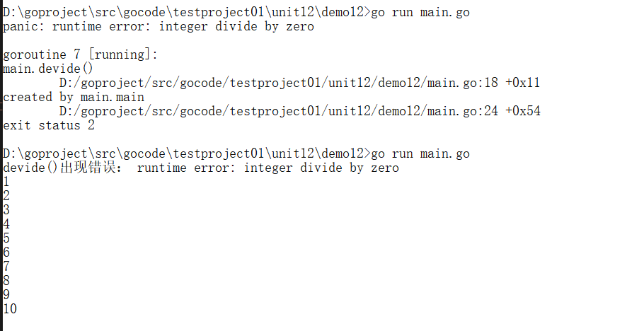
