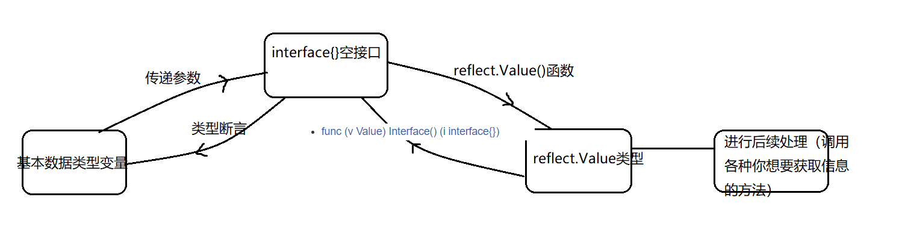
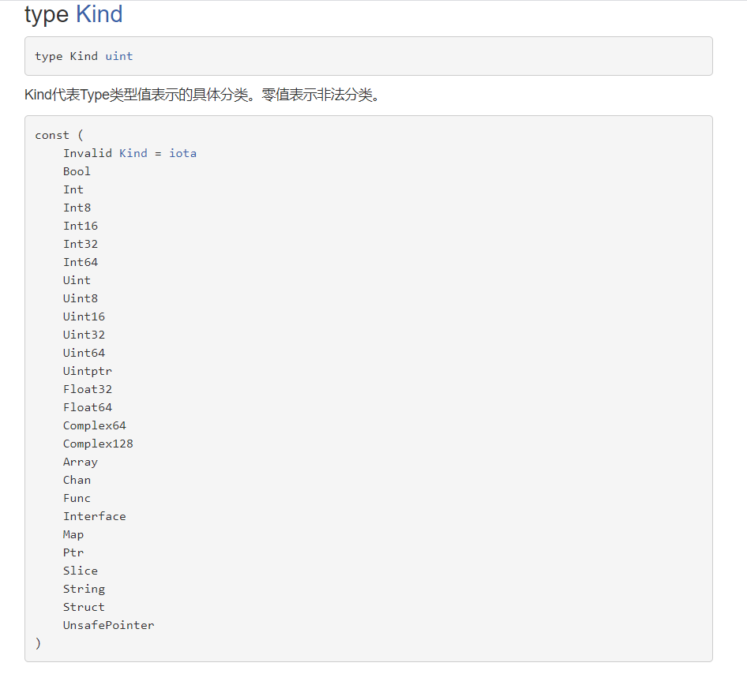
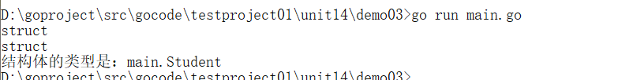
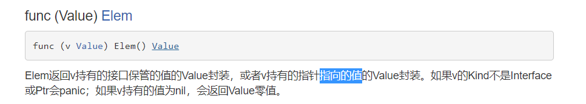

【1】反射可以做什么？
1) 反射可以在运行时动态获取变量的各种信息，比如变量的类型，类别等信息
2) 如果是结构体变量，还可以获取到结构体本身的信息(包括结构体的字段、方法)
3) 通过反射，可以修改变量的值，可以调用关联的方法。
4) 使用反射，需要import ("reflect")
   【2】反射相关的函数
1) reflect.TypeOf(变量名)，获取变量的类型，返回reflect.Type类型
2) reflect.ValueOf(变量名)，获取变量的值，返回reflect.Value类型(reflect.Value是一个结构体类型),通过reflect.Value，可以获取到关于该变量的很多信息。

【1】反射相关的函数
1) reflect.TypeOf(变量名)，获取变量的类型，返回reflect.Type类型
2) reflect.ValueOf(变量名)，获取变量的值，返回reflect.Value类型(reflect.Value是一个结构体类型),通过reflect.Value，可以获取到关于该变量的很多信息。
   【2】代码：

```go
package main
import(
        "fmt"
        "reflect"
)
//利用一个函数，函数的参数定义为空接口：
func testReflect(i interface{}){//空接口没有任何方法,所以可以理解为所有类型都实现了空接口，也可以理解为我们可以把任何一个变量赋给空接口。
        //1.调用TypeOf函数，返回reflect.Type类型数据：
        reType := reflect.TypeOf(i)
        fmt.Println("reType:",reType)
        fmt.Printf("reType的具体类型是：%T",reType)
        //2.调用ValueOf函数，返回reflect.Value类型数据：
        reValue :=reflect.ValueOf(i)
        fmt.Println("reValue:",reValue)
        fmt.Printf("reValue的具体类型是：%T",reValue)
        //num1 := 100
        //如果真想获取reValue的数值，要调用Int()方法：返回v持有的有符号整数
        num2 := 80 + reValue.Int()
        fmt.Println(num2)
        //reValue转成空接口：
        i2 := reValue.Interface()
        //类型断言：
        n := i2.(int)
        n2 := n + 30
        fmt.Println(n2)
}
func main(){
        //对基本数据类型进行反射：
        //定义一个基本数据类型：
        var num int = 100
        testReflect(num)
}
```

【1】反射相关的函数
1) reflect.TypeOf(变量名)，获取变量的类型，返回reflect.Type类型
2) reflect.ValueOf(变量名)，获取变量的值，返回reflect.Value类型(reflect.Value是一个结构体类型),通过reflect.Value，可以获取到关于该变量的很多信息。
   【2】代码： 
```go
package main
import(
        "fmt"
        "reflect"
)
//利用一个函数，函数的参数定义为空接口：
func testReflect(i interface{}){//空接口没有任何方法,所以可以理解为所有类型都实现了空接口，也可以理解为我们可以把任何一个变量赋给空接口。
        //1.调用TypeOf函数，返回reflect.Type类型数据：
        reType := reflect.TypeOf(i)
        fmt.Println("reType:",reType)
        fmt.Printf("reType的具体类型是：%T",reType)
        //2.调用ValueOf函数，返回reflect.Value类型数据：
        reValue :=reflect.ValueOf(i)
        fmt.Println("reValue:",reValue)
        fmt.Printf("reValue的具体类型是：%T",reValue)
        //reValue转成空接口：
        i2 := reValue.Interface()
        //类型断言：
        n,flag := i2.(Student)
        if flag == true {//断言成功
                fmt.Printf("学生的名字是：%v,学生的年龄是：%v",n.Name,n.Age)
        }
        
}
//定义学生结构体：
type Student struct{
        Name string
        Age int
}
func main(){
        //对结构体类型进行反射：
        //定义结构体具体的实例：
        stu := Student{
                Name : "丽丽",
                Age : 18,	
        }
        testReflect(stu)
}
```

【1】获取变量的类别：两种方式：
（1）reflect.Type.Kind()
（2）reflect.Value.Kind()
【2】Kind的值是常量值：

```go
package main
import(
        "fmt"
        "reflect"
)
//利用一个函数，函数的参数定义为空接口：
func testReflect(i interface{}){//空接口没有任何方法,所以可以理解为所有类型都实现了空接口，也可以理解为我们可以把任何一个变量赋给空接口。
        //1.调用TypeOf函数，返回reflect.Type类型数据：
        reType := reflect.TypeOf(i)
        //2.调用ValueOf函数，返回reflect.Value类型数据：
        reValue :=reflect.ValueOf(i)
        //获取变量的类别：
        //（1）reType.Kind()
        k1 := reType.Kind()
        fmt.Println(k1)
        //（2）reValue.Kind()
        k2 := reValue.Kind()
        fmt.Println(k2)
        //获取变量的类型：
        //reValue转成空接口：
        i2 := reValue.Interface()
        //类型断言：
        n,flag := i2.(Student)
        if flag == true {//断言成功
                fmt.Printf("结构体的类型是：%T",n)
        }
}
//定义学生结构体：
type Student struct{
        Name string
        Age int
}
func main(){
        //对结构体类型进行反射：
        //定义结构体具体的实例：
        stu := Student{
                Name : "丽丽",
                Age : 18,	
        }
        testReflect(stu)
}
```


【4】Type和 Kind 的区别
Type是类型, Kind是类别,Type和Kind 可能是相同的，也可能是不同的.
比如:var num int = 10 num的Type是int , Kind也是int
比如:var stu Studentstu的 Type是 pkg1.Student , Kind是struct


【1】修改基本数据类型的值：
```go
package main
import(
        "fmt"
        "reflect"
)
//利用一个函数，函数的参数定义为空接口：
func testReflect(i interface{}){//空接口没有任何方法,所以可以理解为所有类型都实现了空接口，也可以理解为我们可以把任何一个变量赋给空接口。
        reValue :=reflect.ValueOf(i)
        //通过SetInt()来改变值：
        reValue.Elem().SetInt(40)
        
}
func main(){
        //对基本数据类型进行反射：
        //定义一个基本数据类型：
        var num int = 100
        testReflect(&num) //传入指针地址
        fmt.Println(num)
}
```

通过反射操作结构体
【1】代码：（熟知API）
```go
package main
import(
        "fmt"
        "reflect"
)
//定义一个结构体：
type Student struct{
        Name string
        Age int
}
//给结构体绑定方法：
func (s Student) CPrint(){
        fmt.Println("调用了Print()方法")
        fmt.Println("学生的名字是：",s.Name)
}
func (s Student) AGetSum(n1,n2 int) int{
        fmt.Println("调用了AGetSum方法")
        return n1 + n2
}
func (s Student) BSet(name string,age int){
        s.Name = name
        s.Age = age
}
//定义函数操作结构体进行反射操作：
func TestStudentStruct(a interface{}){
        //a转成reflect.Value类型：
        val := reflect.ValueOf(a)
        fmt.Println(val)
        //通过reflect.Value类型操作结构体内部的字段：
        n1 := val.NumField()
        fmt.Println(n1)
        //遍历-获取具体的字段：
        for i := 0; i < n1;i++{
                fmt.Printf("第%d个字段的值是：%v",i,val.Field(i))
        }
        fmt.Println()
        //通过reflect.Value类型操作结构体内部的方法：
        n2 := val.NumMethod()
        fmt.Println(n2)
        //调用CPrint()方法：
        //调用方法，方法的首字母必须大写才能有对应的反射的访问权限
        //方法的顺序按照ASCII的顺序排列的，a,b,c,,,,,,索引：0,1,2，，，，，
        val.Method(2).Call(nil)
        //调用AGetSum方法：
        //定义Value的切片：
        var params []reflect.Value
        params = append(params,reflect.ValueOf(10))
        params = append(params,reflect.ValueOf(20))
        result := val.Method(0).Call(params)
        fmt.Println("AGetSum方法的返回值为：",result[0].Int())
}
func main(){
        //定义结构体具体的实例：
        s := Student{
                Name : "丽丽",
                Age : 18,
        }
        //调用TestStudentStruct：
        TestStudentStruct(s)
}

```
通过反射修改变量
```go
package main
import(
        "fmt"
        "reflect"
)
//定义一个结构体：
type Student struct{
        Name string
        Age int
}
//给结构体绑定方法：
func (s Student) CPrint(){
        fmt.Println("调用了Print()方法")
        fmt.Println("学生的名字是：",s.Name)
}
func (s Student) AGetSum(n1,n2 int) int{
        fmt.Println("调用了AGetSum方法")
        return n1 + n2
}
func (s Student) BSet(name string,age int){
        s.Name = name
        s.Age = age
}
//定义函数操作结构体进行反射操作：
func TestStudentStruct(a interface{}){
        //a转成reflect.Value类型：
        val := reflect.ValueOf(a)
        fmt.Println(val)
        n := val.Elem().NumField()
        fmt.Println(n)
        //修改字段的值：
        val.Elem().Field(0).SetString("张三")
}
func main(){
        //定义结构体具体的实例：
        s := Student{
                Name : "丽丽",
                Age : 18,
        }
        //调用TestStudentStruct：
        TestStudentStruct(&s)
        fmt.Println(s)
}

```